# WMAX — Biznes Model, Bozor Strategiyasi va Ikki Segmentli Arxitektura Rejasi

> **Hujjat maqomi:** To'liq strategik va moliyaviy spetsifikatsiya (Production-ready Business Plan)  
> **Sana:** 2026-09-19  
> **Bog'liq texnik hujjat:** [`WMAX.md`](./WMAX.md) · [`DISASTER_RECOVERY.md`](./DISASTER_RECOVERY.md)  
> **Kontekst:** Umummilliy AI Xakaton (Xorazm) · Sog'liqni saqlash treki (Muammolar: 11 va 12)  
>
> Ushbu hujjat WMAX tizimini bitta lokal klinikadan **ikki segmentli (B2C + B2B) yirik raqamli sog'liqni saqlash ekotizimiga** aylantirish bo'yicha to'liq biznes, operatsion, moliyaviy va arxitektura modelini belgilab beradi.

---

## Mundarija

| # | Bo'lim | Asosiy mavzular |
|---|---|---|
| 1 | [Ikki segment bir qarashda](#1-ikki-segment-bir-qarashda) | B2C vs B2B solishtirma jadvali, umumiy yadro, bozor hajmi (TAM/SAM/SOM) |
| 2 | [Nega bu ikki mahsulot, bir mahsulot emas](#2-nega-bu-ikki-mahsulot-bir-mahsulot-emas) | Javobgarlik zanjiri, R1–R5 qat'iy qoidalar, "Shifokor ulash" ko'prigi |
| 3 | [Segment A — B2C bemorlar va oilalar](#3-segment-a--b2c-bemorlar-va-oilalar) | Haqiqiy to'lovchi (migrant/farzand), tariflar, Unit Economics, konversiya |
| 4 | [Segment B — B2B klinikalar va davlat tizimi](#4-segment-b--b2b-klinikalar-va-davlat-tizimi) | Qayta tushish (readmission) iqtisodiyoti, daromad oqimlari, DMMS sug'urtasi, klinik ROI |
| 5 | [Qurilma iqtisodiyoti va apparat strategiyasi](#5-qurilma-iqtisodiyoti-va-apparat-strategiyasi) | 3-pog'onali apparat ta'minoti (Tier 1–3), BYOD texnik xavfi, inventar va amortizatsiya |
| 6 | [Go-To-Market (GTM) va Savdo Voronkasi](#6-go-to-market-gtm-va-savdo-voronkasi) | B2C va B2B tarqatish kanallari, kasalxonadan chiqarish burchaklari, diaspora marketingi |
| 7 | [Arxitektura va To'lovlar Infratuzilmasi](#7-arxitektura-va-tolovlar-infratuzilmasi) | Multi-tenancy (RLS), huquqlar (entitlements), mahalliy (Payme/Click) va xalqaro to'lovlar |
| 8 | [Ma'lumot modeli (SQL DDL)](#8-malumot-modeli-sql-ddl) | Tenants, Subscriptions, Invoices, Devices, Device Assignments jadvallari |
| 9 | [Bosqichma-bosqich Yo'l Xaritasi (Roadmap)](#9-bosqichma-bosqich-yol-xaritasi-roadmap) | Faza 0 dan Faza 4 gacha bo'lgan amaliy qadamlar |
| 10 | [Ochiq savollarga amaliy yechimlar (Q1 — Q7)](#10-ochiq-savollarga-amaliy-yechimlar-q1--q7) | 103 xizmati, XKT-10, SMS shlyuz, soat logistikasi, yuridik maqom, to'lov qobiliyati |
| 11 | [5 Yillik Moliyaviy Prognoz (2026–2030)](#11-5-yillik-moliyaviy-prognoz-20262030) | Bemorlar o'sishi, tushum, COGS, OPEX, EBITDA va sof marja |
| 12 | [Regulyatorlik, Yuridik Asos va Kiberxavfsizlik](#12-regulyatorlik-yuridik-asos-va-kiberxavfsizlik) | O'zbekiston Qonunchiligi (O'RQ-547), SaMD chegarasi, PHI anonimizatsiyasi |
| 13 | [Ijtimoiy Ta'sir (ESG) va Klinik Samara](#13-ijtimoiy-tasir-esg-va-klinik-samara) | O'lim ko'rsatkichini pasaytirish, hamshiralar unumdorligi, xotirjamlik indeksi |

---

# 1. Ikki segment bir qarashda

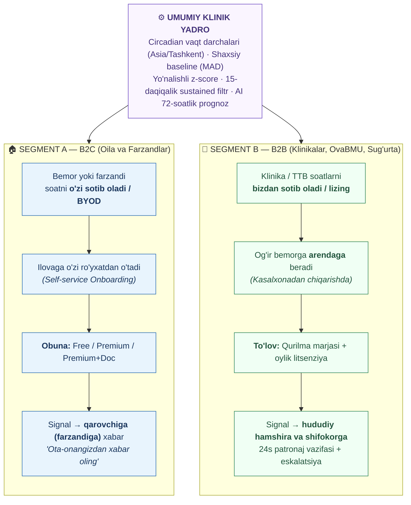

### B2C va B2B taqqoslash matritsasi

| Parametr | Segment A — B2C (Household) | Segment B — B2B (Healthcare Facilities) |
|---|---|---|
| **Asosiy xaridor (To'lovchi)** | Chet eldagi yoki poytaxtdagi farzand (migrant) | Xususiy klinika, TTB (tuman tibbiyot birlashmasi), OvaBMU, DMMS |
| **Foydalanuvchi** | Yoshi katta ota-ona (surunkali bemor) | Bemor + hududiy hamshira + oilaviy shifokor |
| **Qurilma ta'minoti** | O'zi sotib oladi, mavjud soatini ulaydi (BYOD) | Klinika inventaridan arendaga beriladi (30–90 kun) |
| **Daromad modeli** | Oylik/Yillik SaaS obunasi (B2C) | Qurilma savdosi marjasi + Oylik faol litsenziya (B2B SaaS) |
| **Qizil signalga javobgar** | ⚠️ **Qarovchi (oilasi)** — shifokor majburiyati yo'q | 👩‍⚕️ **Klinik xodim** — 24 soatlik majburiy chaqiruv va eskalatsiya |
| **Mahsulot mohiyati** | Oila xotirjamligi va monitoring (Awareness) | **Davomiy klinik parvarish tizimi** (Care Delivery) |
| **Yuridik javobgarlik** | Past (ma'lumot beruvchi, tashxis qo'ymaydi) | Yuqori (tibbiy protokol va standartlarga javob beradi) |
| **Muammo 11 ni yopishi** | ❌ Yo'q (hududiy xabarnoma zanjiri yo'q) | ✅ Ha (avtomatik topshirish va qabul tasdig'i) |
| **Sotuv sikli** | Bir necha daqiqa (onlayn konversiya) | 1–3 oy (shartnoma, tender, ma'muriy tasdiq) |
| **Bozor drayveri** | Farzandning g'amxo'rligi va masofa tashvishi | Qayta yotishni (readmission) kamaytirish, TTB hisoboti |

---

## 1.2 Bozor Hajmi (Market Sizing — O'zbekiston va Markaziy Osiyo)

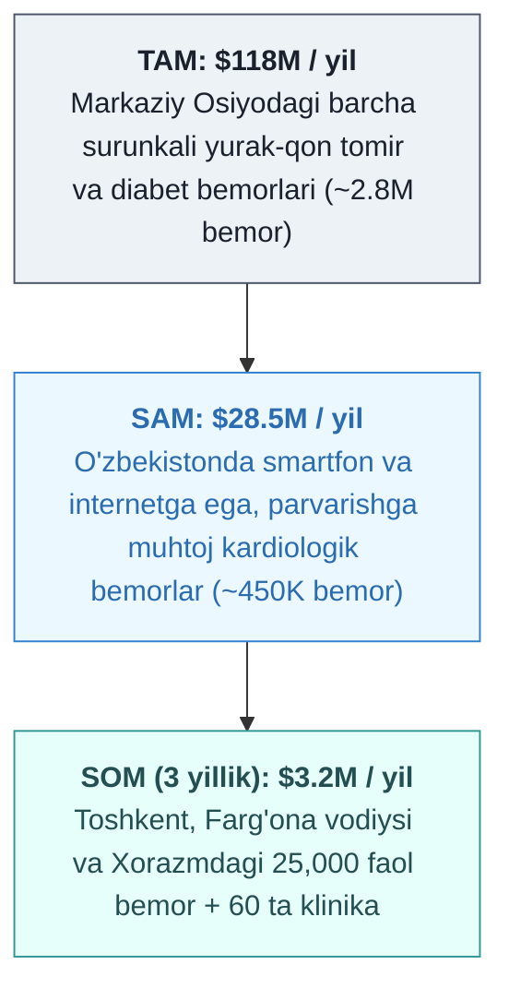

- **O'zbekiston demografiyasi:** Aholi soni 37.5 mln kishi. 60 yoshdan oshganlar ulushi 9.5% (~3.5 mln).
- **Kasallanish statistikasi:** 1.2 milliondan ortiq bemor qon aylanish tizimi kasalliklari (I00–I99) va qandli diabet (E10–E14) bo'yicha doimiy dispanser nazoratida turadi.
- **Har yili statsionarga tushuvchilar:** Har yili ~180,000 bemor kardiologik statsionarlardan chiqariladi. Ularning 22–26 foizi dastlabki 30 kun ichida holati qayta og'irlashib, reanimatsiya yoki shoshilinch bo'limga qaytadi.
- **WMAX nishoni:** Aynan shu statsionardan chiqqan 180,000 bemor va ularning xorijda/boshqa shaharda yashovchi daromadli farzandlari.

---

# 2. Nega bu ikki mahsulot, bir mahsulot emas

> ### 🔴 Eng muhim farq: Qizil signal chiqqanda **KIM QIDIRILADI?**

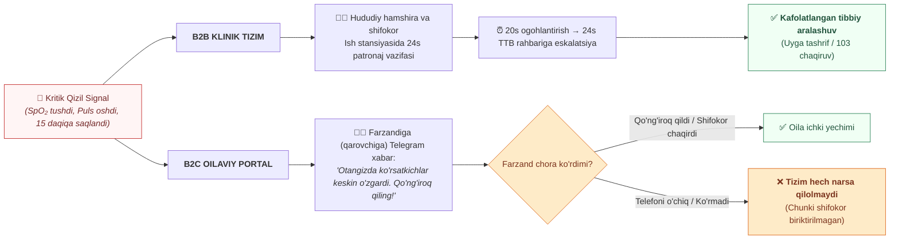

## 2.1 Domen va Etik Qoidalar (Qat'iy Cheklovlar)

Ushbu qoidalar tizimning xavfsizligi, tibbiy-huquqiy daxlsizligi va obro'sini himoya qiladi:

| # | Qoida | Izoh va Huquqiy Rationale |
|---|---|---|
| **R1** | **B2C da sun'iy "aktiv chaqiruv" vazifasi YARATILMAYDI** | Vazifani bajaruvchi mas'ul tibbiy xodim bo'lmagan joyda "vazifa ochildi" deb yozish — foydalanuvchiga yolg'on xotirjamlik beradi va o'lim xavfini keltirib chiqaradi. |
| **R2** | **B2C interfeysida "Shifokor biriktirilmagan" maqomi DOIM ko'rinadi** | Bemor va qarovchi WMAX ularning nomidan tez yordam chaqirmasligini, bu shunchaki individual monitoring ekanligini aniq anglab turishi shart. |
| **R3** | **B2C xabarlari hech qachon TASHXIS qo'ymaydi** | "Sizda miokard infarkti boshlandi" ❌ (Noqonuniy tibbiy xulosa). "Ko'rsatkichlar shaxsiy normadan jiddiy og'ishdi, darhol shifokorga murojaat qiling" ✅. |
| **R4** | **B2C marketingida mahsulot "Tibbiy apparat (Medical Device)" deb atalmaydi** | Farmatsevtika qo'mitasi litsenziyasi bo'lmaguncha, mahsulot — "Sog'lom turmush tarzi va masofaviy monitoring dasturi" sifatida taqdim etiladi. |
| **R5** | **B2B da har bir bemorga ANIQ mas'ul shaxs (hamshira/shifokor) biriktiriladi** | Mas'ulsiz ro'yxatga olish taqiqlanadi. Agar mahalla bo'yicha hamshira topilmasa — bemor to'g'ridan-to'g'ri TTB bosh shifokoriga "Yo'naltirilmagan" xatosi bilan tushadi. |

---

## 2.2 Segmentlar Ko'prigi: "Shifokor Ulash" (Telehealth Upsell)

B2C ning eng zaif tomoni (tizimda shifokor yo'qligi) — WMAX uchun eng kuchli va yuqori rentabelli **tijoriy ko'prikdir**:

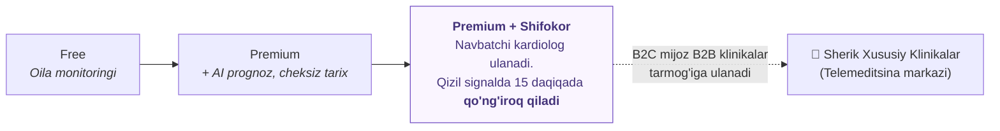

Bu model orqali:
1. B2C foydalanuvchisi xohlagan paytda professional tibbiy himoyaga ega bo'ladi.
2. Sherik xususiy klinikalar o'z shifokorlarining bo'sh vaqtini monetizatsiya qiladi (RevShare 60/40).
3. WMAX qimmat klinik shtat ushlamasdan telemeditsina operatoriga aylanadi.

---

# 3. Segment A — B2C bemorlar va oilalar

## 3.1 Haqiqiy to'lovchi psixologiyasi: "Uzoqdagi Farzand"

> **Kassaga 70 yoshli nafaqaxo'r bormaydi. Pulni Toshkentda bankda ishlayotgan, Moskvada qurilish boshqarayotgan yoki Janubiy Koreyada zavodda ishlayotgan 28–45 yoshli farzand to'laydi.**

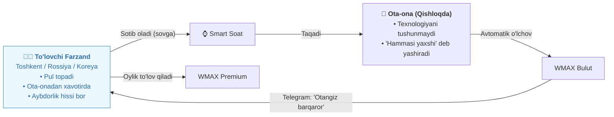

### Bundan kelib chiqadigan mahsulot qarorlari:
1. **Sotish nuqtasi — Qarovchi Ilovasi (`web-relative`):** Bemor ekranidan ko'ra, farzandning mobil portali mukammal bo'lishi kerak.
2. **Sotiladigan qadriyat — "Xotirjamlik (Peace of Mind)":** "Otangizning qon bosimi 140/90" emas, "Otangiz bugun barqaror, ertalab sayr qildi, dori ichildi" degan xotirjamlik hissi sotiladi.
3. **Diaspora to'lovlari:** Rossiyadagi muhojirlar Mir/Humo kartalari orqali, Koreya va AQShdagi vatandoshlar xalqaro Visa/Mastercard orqali to'lay olishi shart.
4. **Nol yuklama:** Qariyaga "har kuni ilovani ochib tugma bos" deyilmaydi. Soat qo'lga taqiladi, tamom. Qolganini tizim o'zi qiladi.

---

## 3.2 B2C Tariflarining Aniq Tuzilmasi

> ⛔ **Etik qoida:** Kritik signal aniqlanganda qarovchiga xabar berish **Free tarifda ham cheklanmaydi**. Pul faqat chuqur tahlil, qulaylik va tibbiy xizmat uchun olinadi.

| Xizmat / Imkoniyat | Free (Baza) | Premium (Tahliliy) | Premium + Shifokor |
|---|:---:|:---:|:---:|
| **Oylik obuna narxi (UZS)** | **0 so'm** | **59,000 so'm / oy**<br/>*(yoki 590,000 so'm / yil)* | **249,000 so'm / oy**<br/>*(yoki 2,490,000 so'm / yil)* |
| **Oylik narx (USD ekvivalenti)** | $0 | ~$4.60 / oy | ~$19.50 / oy |
| Jonli fiziologik ko'rsatkichlar (HR, SpO₂, RR, Temp) | ✅ | ✅ | ✅ |
| Shaxsiy 7 kunlik baseline o'rganish | ✅ | ✅ | ✅ |
| Holat indikatori (Yashil / Sariq / Qizil) | ✅ | ✅ | ✅ |
| **Qizil kritik signalda Telegram xabar** | ✅ (1 ta qarovchiga) | ✅ (5 tagacha oila a'zosi) | ✅ (Oila + Shifokor) |
| SOS favqulodda chaqiruv tugmasi | ✅ | ✅ | ✅ |
| Tarix chuqurligi | 7 kun | Cheksiz | Cheksiz |
| **AI 72-soatlik Dekompensatsiya Prognozi** | ❌ | ✅ | ✅ |
| Dori samaradorligi tahlili (L1 Response) | ❌ | ✅ | ✅ |
| Shifokor qabuliga olib borish uchun PDF hisobot | ❌ | ✅ (Bir marta bosishda) | ✅ (Avtomatik tayyor) |
| SMS orqali zaxira xabarnoma | ❌ | ✅ (Oyiga 30 tagacha) | ✅ (Cheksiz kritik SMS) |
| **24/7 Navbatchi Shifokor nazorati** | ❌ | ❌ | ✅ |
| **Qizil signalda shifokorning tezkor qo'ng'irog'i** | ❌ | ❌ | ✅ (15 daqiqa ichida) |
| Oylik rejaviy tele-konsultatsiya | ❌ | ❌ | ✅ (Oyiga 2 marta) |

---

## 3.3 B2C Unit Economics (Birlik Iqtisodiyoti)

Bitta Premium foydalanuvchi hisobidagi oylik ko'rsatkichlar:

```
┌────────────────────────────────────────────────────────┐
│ B2C PREMIUM: 59,000 so'm / oy ($4.60)                  │
├────────────────────────────────────────────────────────┤
│ O'zgaruvchan xarajatlar (Oylik COGS):                  │
│  - PostgreSQL + Cloud hosting (ulush):     1,800 so'm  │
│  - AI LLM API (DeepSeek batch prognoz):    1,200 so'm  │
│  - SMS xabarnomalar (Eskiz.uz ~10 ta):       850 so'm  │
│  - To'lov tizimi komissiyasi (Payme 1.5%):   885 so'm  │
│  - JAMI COGS:                              4,735 so'm  │
├────────────────────────────────────────────────────────┤
│ YALPI FOYDA (Gross Profit):               54,265 so'm  │
│ YALPI MARJA (Gross Margin):                     91.9%  │
└────────────────────────────────────────────────────────┘
```

### Mijozning Butun Hayotiy Qiymati (LTV) va Jalb Qilish Xarajati (CAC)

- **O'rtacha saqlanib qolish davri (Retention):** 14 oy (surunkali kasalliklar uzoq davom etadi).
- **LTV (Lifetime Value):** $14 \times 54,265\text{ so'm} = \mathbf{759,710\text{ so'm}}\ (\approx \$59.30)$.
- **CAC (Customer Acquisition Cost):** Raqamli marketing (Instagram/Telegram) va kasalxona burchaklari orqali jalb qilish: $\mathbf{65,000\text{ so'm}}\ (\approx \$5.00)$.
- **LTV / CAC nisbati:** $\frac{759,710}{65,000} = \mathbf{11.6\times}$ *(SaaS standarti bo'yicha $3\times$ dan yuqorisi a'lo hisoblanadi).*
- **O'zini oqlash muddati (Payback Period):** $1.2\text{ oy}$.

---

# 4. Segment B — B2B klinikalar va davlat tizimi

## 4.1 Klinika nima uchun to'laydi? (Qiymat taklifi)

Klinika "texnologik chiroyli grafik" uchun to'lamaydi. U quyidagi **og'riqlarni yechish** uchun to'laydi:

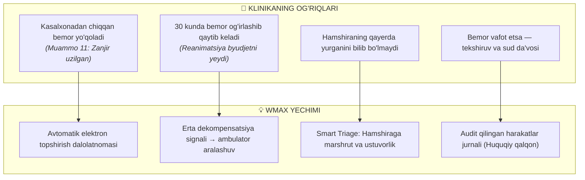

---

## 4.2 Qayta kasalxonaga tushish (Readmission) iqtisodiyoti va Klinik ROI

O'zbekiston sog'liqni saqlash byudjeti uchun 1 ta og'ir reanimatsiya holati:
- O'rtacha 7–10 kunlik intensiv davolash: **4,500,000 — 8,000,000 so'm** ($350 – $620).
- 100 ta surunkali yurak yetishmovchiligi (NYHA III–IV) bemorining 25 tasi 1 oyda qayta tushadi. Umumiy sarf-xarajat: $\approx 125,000,000\text{ so'm}$.

**WMAX bilan natija:**
- WMAX erta ambulator aralashuv orqali qayta yotish ko'rsatkichini 25 tadan 12 tagacha (kamida 50% ga) tushiradi.
- Tejalgan to'g'ridan-to'g'ri byudjet: $13 \times 5,000,000 = \mathbf{65,000,000\text{ so'm / oy}}$.
- WMAX 100 bemorlik oylik litsenziya xarajati: **8,500,000 so'm**.
- **Klinika / Davlat Tibbiy Sug'urtasi uchun sof oylik tejamkorlik:** $\mathbf{56,500,000\text{ so'm}}$.
- **Klinik ROI:** $\mathbf{7.6\times}\ (760\%)$.

---

## 4.3 B2B Litsenziyalash va Narxlar

Klinikalar uchun litsenziya **qurilma soniga emas, oylik faol bemor soniga** bog'lanadi:

| Muassasa toifasi | Bemorlar soni | Oylik litsenziya (UZS) | Bemor boshiga tannarx | Qo'shimcha imkoniyatlar |
|---|:---:|:---:|:---:|---|
| **Kichik bo'lim / Poliklinika** | 25 tagacha | **2,375,000 so'm** | 95,000 so'm | Shifokor stansiyasi, Telegram eskalatsiya |
| **Tuman Tibbiyot Birlashmasi (TTB)** | 100 tagacha | **8,500,000 so'm** *(chegirma)* | 85,000 so'm | Tuman bo'yicha Triage xaritasi, TTB rahbari nazorati |
| **Viloyat Kardiologiya Markazi** | 300 tagacha | **22,500,000 so'm** | 75,000 so'm | To'liq API integratsiya, HIS/MIS eksporti |
| **Respublika / Korporativ** | 1,000+ | Shartnoma asosida | Maxsus tarif | Alohida server (On-premise / Private Cloud) |

### Klinika uchun Arenda Daromad Modeli:
Klinika WMAX soatini bemorga kasalxonadan chiqarishda 30–60 kunga arendaga beradi:
- Bemor to'laydigan arenda: **180,000 so'm / oy** + 500,000 so'm qaytariladigan depozit.
- Klinikaning WMAX litsenziya xarajati: **85,000 so'm / oy**.
- **Klinikaning sof marjasi:** **95,000 so'm / oy / bemor**.
> Natijada klinika WMAX'ni "xarajat" sifatida emas, balki **yangi qo'shimcha daromad keltiruvchi tibbiy servis** sifatida qabul qiladi.

---

# 5. Qurilma iqtisodiyoti va apparat strategiyasi

## 5.1 Asosiy to'siq va 3-Pog'onali Apparat Strategiyasi

Samsung Galaxy Watch 5 narxi (~$200) O'zbekiston aholisi uchun jiddiy moliyaviy to'siq. Shuning uchun WMAX **faqat bitta brendga bog'lanib qolmaydi**:

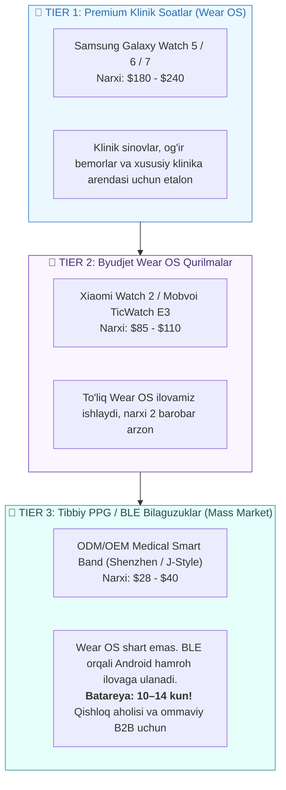

---

## 5.2 BYOD (Bring Your Own Device) ning Texnik va Klinik Xavfi

Foydalanuvchi o'zining shaxsiy soatini ulaganda, sensor apparat xarakteristikalari o'rtasidagi farq xavf tug'diradi:

```
Masalan:
Galaxy Watch 4 PPG sensori: o'rtacha HR 68 bpm, SpO₂ 97%
Foydalanuvchi Watch 6 ga o'tdi: yangi sensor o'lchovi: HR 73 bpm, SpO₂ 95%
AGAR TIZIM BILMASA: 
→ Darhol yolg'on chetlanish (false alarm) yozadi, shifokor va oilani bezovta qiladi.
```

### Majburiy Texnik Standart:
1. `device_id` yoki soat modeli o'zgarganda — **oldingi baseline darhol arxivlanadi**.
2. Tizim avtomatik tarzda yangi **5 kunlik kalibratsiya fazasiga (`calib`)** o'tadi.
3. Foydalanuvchi va shifokor ekranida: *"Yangi qurilma aniqlandi — 5 kunlik moslashuv davri ketmoqda"* xabari chiqadi.

---

## 5.3 Qurilma Hayotiy Sikli va Arenda Holat Mashinasi

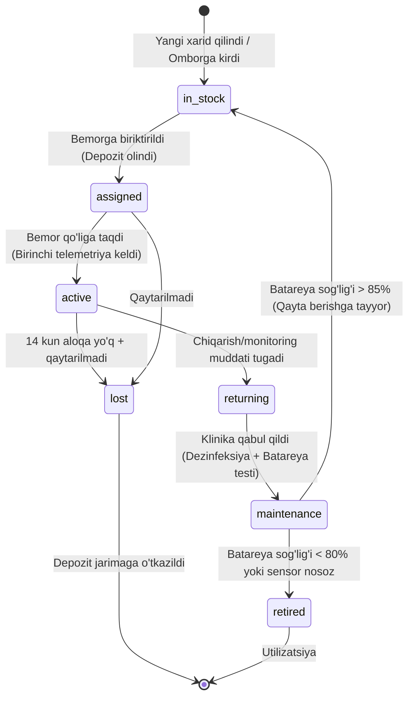

---

# 6. Go-To-Market (GTM) va Savdo Voronkasi

## 6.1 B2C Tarqatish Voronkasi (Qayerdan xaridor topamiz?)

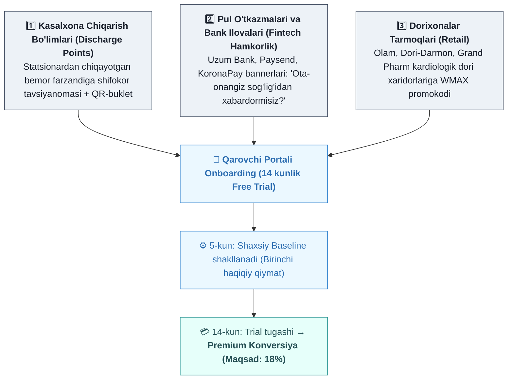

---

## 6.2 B2B Sotuv Sikli (Davlat va Xususiy Sektor)

1. **Bosqich 1: Pilot loyiha (30 kun — Bepul 15 ta qurilma bilan):**
   - Xorazm viloyat kardiologiya markazi yoki tuman poliklinikasida 15 nafar og'ir bemorga o'rnatiladi.
   - Metrika: 30 kunlik qayta kasalxonaga yotish dinamikasi va hamshira patronajining bajarilish foizi ko'rsatiladi.
2. **Bosqich 2: Bosh shifokor va TTB kengashiga iqtisodiy hisobot:**
   - *"WMAX orqali reanimatsiyaga qayta tushish 40% kamaydi, bo'lim 32 mln so'm byudjetni tejab qoldi"*.
3. **Bosqich 3: Oylik abonent shartnomasi yoki Davlat xaridlari (Tender):**
   - Dasturiy ta'minot litsenziyasi sifatida to'g'ridan-to'g'ri shartnoma yoki davlat xaridlari portalida e'lon qilinadi.

---

# 7. Arxitektura va To'lovlar Infratuzilmasi

## 7.1 Multi-tenancy — Qat'iy Xavfsizlik Arxitekturasi

WMAX barcha tashkilotlar (va hatto har bir B2C oila) ma'lumotlarini bitta ma'lumotlar bazasida **to'liq izolyatsiya** qiladi:

```python
# app/core/tenant.py
from contextvars import ContextVar
import uuid

current_tenant_id: ContextVar[uuid.UUID | None] = ContextVar("current_tenant_id", default=None)

# app/repositories/base.py
class TenantScopedRepository:
    """Barcha so'rovlar chaqiruvchining tenant_id siga qat'iy bog'lanadi.
    
    Servislarda tenant_id ni qo'lda yozish shart emas — repo darajasida filtrlanadi.
    Klinika A shifokori hech qachon Klinika B bemorini ko'ra olmaydi.
    """
    def _apply_tenant_filter(self, stmt):
        tenant_id = current_tenant_id.get()
        if tenant_id is None:
            raise PermissionError("Joriy tenant konteksti topilmadi!")
        return stmt.where(self.model.tenant_id == tenant_id)
```

Postgres darajasida esa **Row-Level Security (RLS)** oxirgi himoya qatlami sifatida xizmat qiladi:
```sql
ALTER TABLE patients ENABLE ROW LEVEL SECURITY;

CREATE POLICY patient_tenant_isolation ON patients
    USING (tenant_id = NULLIF(current_setting('app.current_tenant_id', true), '')::uuid);
```

---

## 7.2 Imkoniyatlarni Boshqarish (Entitlement Engine)

Tarif cheklovlari tasodifiy endpointlarda emas, yagona deklarativ matritsa orqali boshqariladi:

```python
# app/billing/entitlements.py
from enum import Enum
from fastapi import HTTPException, status

class Feature(str, Enum):
    VITALS = "vitals"
    BASELINE = "baseline"
    STATUS_COLOR = "status_color"
    CRITICAL_ALERT = "critical_alert"
    SOS_BUTTON = "sos_button"
    AI_PROGNOSIS = "ai_prognosis"
    MEDICATION_RESPONSE = "medication_response"
    UNLIMITED_HISTORY = "unlimited_history"
    PDF_REPORT = "pdf_report"
    ON_CALL_DOCTOR = "on_call_doctor"
    CLINIC_WORKLIST = "clinic_worklist"
    CLINIC_ESCALATION = "clinic_escalation"

PLAN_FEATURES = {
    "free": {
        Feature.VITALS, Feature.BASELINE, Feature.STATUS_COLOR,
        Feature.CRITICAL_ALERT, Feature.SOS_BUTTON
    },
    "premium": {
        Feature.VITALS, Feature.BASELINE, Feature.STATUS_COLOR,
        Feature.CRITICAL_ALERT, Feature.SOS_BUTTON, Feature.AI_PROGNOSIS,
        Feature.MEDICATION_RESPONSE, Feature.UNLIMITED_HISTORY, Feature.PDF_REPORT
    },
    "premium_doc": {
        # Barcha premium imkoniyatlar + shifokor
        Feature.VITALS, Feature.BASELINE, Feature.STATUS_COLOR,
        Feature.CRITICAL_ALERT, Feature.SOS_BUTTON, Feature.AI_PROGNOSIS,
        Feature.MEDICATION_RESPONSE, Feature.UNLIMITED_HISTORY, Feature.PDF_REPORT,
        Feature.ON_CALL_DOCTOR
    },
    "clinic": {
        # To'liq klinik funksiyalar
        Feature.VITALS, Feature.BASELINE, Feature.STATUS_COLOR,
        Feature.CRITICAL_ALERT, Feature.SOS_BUTTON, Feature.AI_PROGNOSIS,
        Feature.MEDICATION_RESPONSE, Feature.UNLIMITED_HISTORY, Feature.PDF_REPORT,
        Feature.CLINIC_WORKLIST, Feature.CLINIC_ESCALATION
    }
}

def check_entitlement(tenant_plan: str, feature: Feature) -> None:
    if feature not in PLAN_FEATURES.get(tenant_plan, set()):
        raise HTTPException(
            status_code=status.HTTP_402_PAYMENT_REQUIRED,
            detail=f"Ushbu funksiya sizning '{tenant_plan}' tarifingizda mavjud emas."
        )
```

---

## 7.3 To'lov Tizimlari Integratsiyasi (Mahalliy va Xalqaro)

O'zbekistonda Stripe/PayPal mahalliy bank kartalari (Uzcard/Humo) uchun to'g'ridan-to'g'ri ishlamaydi. Shuning uchun gibrid to'lov me'morchiligi joriy etiladi:

1. **Mahalliy takroriy to'lov (Recurrent Billing):**
   - **Payme Business (Subscribe API) / Click Merchant API:**
   - Foydalanuvchi bir marta karta raqamini kiritib, SMS-tasdiq kodini teradi.
   - WMAX kartaning `card_token`ini oladi va har 30 kunda avtomatik to'lovni yechadi.
2. **Rossiyadagi migrantlar uchun:**
   - **Uzum Bank / KoronaPay API:** Mir kartasidan to'g'ridan-to'g'ri so'm hisobiga konvertatsiya bilan obunani to'lash.
3. **Uzoq xorijiy davlatlar (AQSh, Koreya, Yevropa) uchun:**
   - **Stripe Checkout / Tazapay:** Xorijiy kartalardan USD orqali to'lov qabul qilish.

---

# 8. Ma'lumot modeli (SQL DDL)

Biznes modelni amalga oshirish uchun mavjud SQLAlchemy/PostgreSQL arxitekturasiga quyidagi yangi modellar qo'shiladi:

```sql
-- 1. TENANTS (Tashkilotlar va Oilaviy kabinetlar)
CREATE TYPE tenant_kind AS ENUM ('household', 'clinic', 'ovabmu', 'polyclinic', 'network');
CREATE TYPE plan_code   AS ENUM ('free', 'premium', 'premium_doc', 'clinic');
CREATE TYPE sub_status  AS ENUM ('trialing', 'active', 'past_due', 'canceled', 'free');

CREATE TABLE tenants (
    id          UUID PRIMARY KEY DEFAULT gen_random_uuid(),
    kind        tenant_kind NOT NULL DEFAULT 'household',
    name        TEXT NOT NULL,
    -- B2B rekvizitlari
    legal_name  TEXT,
    tax_id      TEXT,
    region      TEXT NOT NULL DEFAULT 'Xorazm',
    district    TEXT,
    -- B2C egasi
    owner_phone TEXT,
    is_active   BOOLEAN NOT NULL DEFAULT TRUE,
    created_at  TIMESTAMPTZ NOT NULL DEFAULT now()
);

-- Mavjud jadvallarni tenantga bog'lash
ALTER TABLE patients ADD COLUMN tenant_id UUID REFERENCES tenants(id);
ALTER TABLE users    ADD COLUMN tenant_id UUID REFERENCES tenants(id);
CREATE INDEX idx_patients_tenant ON patients(tenant_id);
CREATE INDEX idx_users_tenant    ON users(tenant_id);

-- 2. SUBSCRIPTIONS (Obunalar)
CREATE TABLE subscriptions (
    id                 UUID PRIMARY KEY DEFAULT gen_random_uuid(),
    tenant_id          UUID NOT NULL UNIQUE REFERENCES tenants(id) ON DELETE CASCADE,
    plan               plan_code NOT NULL DEFAULT 'free',
    status             sub_status NOT NULL DEFAULT 'trialing',
    trial_ends_at      TIMESTAMPTZ,
    current_period_end TIMESTAMPTZ,
    grace_until        TIMESTAMPTZ,      -- past_due bo'lsa 7 kunlik xavfsizlik oynasi
    seats_included     INTEGER DEFAULT 1, -- B2B da faol bemorlar limiti
    provider           TEXT CHECK (provider IN ('payme', 'click', 'uzum', 'stripe', 'manual')),
    card_token         TEXT,             -- Avtomatik yechish uchun xavfsiz token
    canceled_at        TIMESTAMPTZ,
    created_at         TIMESTAMPTZ NOT NULL DEFAULT now(),
    updated_at         TIMESTAMPTZ NOT NULL DEFAULT now()
);

-- 3. INVOICES & PAYMENTS (Hisoblar va Tranzaksiyalar)
CREATE TABLE invoices (
    id              UUID PRIMARY KEY DEFAULT gen_random_uuid(),
    tenant_id       UUID NOT NULL REFERENCES tenants(id) ON DELETE CASCADE,
    period_start    DATE NOT NULL,
    period_end      DATE NOT NULL,
    active_patients INTEGER NOT NULL DEFAULT 1,
    amount_uzs      BIGINT NOT NULL,
    status          TEXT NOT NULL DEFAULT 'open' CHECK (status IN ('open','paid','overdue','void')),
    due_at          TIMESTAMPTZ NOT NULL,
    paid_at         TIMESTAMPTZ,
    created_at      TIMESTAMPTZ NOT NULL DEFAULT now()
);

CREATE TABLE payments (
    id           UUID PRIMARY KEY DEFAULT gen_random_uuid(),
    invoice_id   UUID NOT NULL REFERENCES invoices(id) ON DELETE CASCADE,
    provider     TEXT NOT NULL,
    provider_txn TEXT NOT NULL,
    amount_uzs   BIGINT NOT NULL,
    status       TEXT NOT NULL CHECK (status IN ('pending','succeeded','failed','refunded')),
    raw_payload  JSONB,
    created_at   TIMESTAMPTZ NOT NULL DEFAULT now(),
    CONSTRAINT uq_payment_provider_txn UNIQUE (provider, provider_txn)
);

-- 4. DEVICES & ASSIGNMENTS (Qurilmalar inventari va Arenda)
CREATE TYPE device_tier AS ENUM ('tier1_wearos', 'tier2_wearos_budget', 'tier3_ble_band');
CREATE TYPE device_status AS ENUM ('in_stock', 'assigned', 'active', 'returning', 'maintenance', 'lost', 'retired');

CREATE TABLE devices (
    id                 UUID PRIMARY KEY DEFAULT gen_random_uuid(),
    tenant_id          UUID REFERENCES tenants(id) ON DELETE SET NULL, -- NULL = Bizning markaziy ombor
    serial_number      TEXT NOT NULL UNIQUE,
    model_name         TEXT NOT NULL,                                  -- Masalan: 'Galaxy Watch 5 44mm'
    tier               device_tier NOT NULL DEFAULT 'tier1_wearos',
    status             device_status NOT NULL DEFAULT 'in_stock',
    ownership          TEXT NOT NULL DEFAULT 'owned' CHECK (ownership IN ('owned','leased','patient_owned')),
    battery_health_pct SMALLINT CHECK (battery_health_pct BETWEEN 0 AND 100),
    last_sync_at       TIMESTAMPTZ,
    created_at         TIMESTAMPTZ NOT NULL DEFAULT now()
);

CREATE TABLE device_assignments (
    id               UUID PRIMARY KEY DEFAULT gen_random_uuid(),
    device_id        UUID NOT NULL REFERENCES devices(id) ON DELETE CASCADE,
    patient_id       UUID NOT NULL REFERENCES patients(id) ON DELETE CASCADE,
    assigned_by      UUID REFERENCES users(id),
    assigned_at      TIMESTAMPTZ NOT NULL DEFAULT now(),
    deposit_uzs      BIGINT DEFAULT 0,
    rental_uzs_month BIGINT DEFAULT 0,
    due_back_at      TIMESTAMPTZ,
    returned_at      TIMESTAMPTZ,
    return_notes     TEXT,
    deposit_refunded BOOLEAN NOT NULL DEFAULT FALSE
);
CREATE INDEX idx_device_assignment_active ON device_assignments(device_id) WHERE returned_at IS NULL;
```

---

# 9. Bosqichma-bosqich Yo'l Xaritasi (Roadmap)

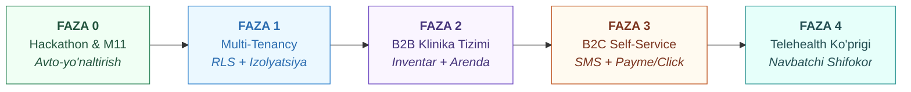

### Amaliy Bosqichlar Rejasi:

- **Faza 0: Xakaton MVP va Muammo 11 ni yopish (Hozirgi holat):**
  - Chiqarish akti (`discharge_handoffs`), hududiy hamshiraga avtomatik yo'naltirish, qabul tasdig'i, 24 soatlik patronaj taymeri va eskalatsiya.
- **Faza 1: Multi-Tenancy va Xavfsizlik Poydevori (1-oy):**
  - `tenants` modeli, Alembic migratsiyasi, Repository qatlamida majburiy filtrlar, RLS, klinikalararo ma'lumotlar sizishini 100% istisno qiluvchi testlar.
- **Faza 2: B2B To'liq Klinik Paket va Inventar (2–3-oylar):**
  - `devices` va `device_assignments` holat mashinasi, klinika admin paneli, TTB hisobot moduli, qurilma almashganda baseline kalibratsiyasi.
- **Faza 3: B2C Ommaviy Portal va To'lovlar (4–5-oylar):**
  - SMS orqali mustaqil ro'yxatdan o'tish (Self-signup), Payme/Click recurrent to'lovlar, 14 kunlik avtomatik trial, PDF hisobot eksporti.
- **Faza 4: Premium + Navbatchi Shifokor Telemeditsina Tarmog'i (6+ oylar):**
  - Sherik klinikalar bilan RevShare shartnomalari, 24/7 navbatchilik jadvali dispetcheri, qizil signalda avtomatik qo'ng'iroq oqimi.

---

# 10. Ochiq savollarga amaliy yechimlar (Q1 — Q7)

Oldingi loyiha rejasida ochiq qolgan 7 ta savolga ishlab chiqilgan aniq javoblar:

| # | Savol | Aniq Amaliy Yechim va Strategiya | Mas'ul yo'nalish |
|---|---|---|---|
| **Q1** | **103 Tez Yordam xizmatining API/protokoli bormi?** | 103 tizimida hozircha ochiq umumiy API yo'q. Shuning uchun **2 bosqichli yechim** qo'llanadi: <br>1. *Hozir:* Qizil signalda qarovchi va hamshiraga bir bosishda 103 ga qo'ng'iroq qilish va bemorning aniq GPS manzili, orientiri hamda oxirgi 15 daqiqalik telemetriyasini ochuvchi SMS/Telegram havola beriladi. <br>2. *Keyin:* SSV Raqamlashtirish markazi bilan memorandum orqali 103 dispetcherlik dasturiga (Call-markaz) webhook orqali to'g'ridan-to'g'ri chaqiruv kartasini kiritish. | Tashkiliy / Integratsiya |
| **Q2** | **XKT-10 (ICD-10) o'zbek tilidagi ma'lumotnomasi qayerdan olinadi?** | O'zbekiston Respublikasi Sog'liqni saqlash vazirligining rasmiy tarjima qilingan XKT-10 klassifikatori bazasi olinadi. WMAX uchun faqat kardiologiya (I00–I99) va endokrinologiya (E10–E14) bo'yicha 120 ta eng ko'p uchraydigan kodlar saralab olinib, lokal lug'at sifatida keshlanadi. | Klinik ekspertiza |
| **Q3** | **SMS Gateway provayderi va xarajati qanday?** | O'zbekistonda rasmiy litsenziyalangan SMS agregatorlari — **Eskiz.uz** yoki **PlayMobile** REST API orqali ulanadi. Narxi: 1 ta SMS $\approx 75 - 85\text{ so'm}$. Har bir Premium obuna tannarxiga oyiga 15–20 ta SMS xarajati (1,500 so'm) hisoblab kiritilgan. | Texnik / Moliya |
| **Q4** | **Aqlli soatlarni kim sotib oladi, yetkazib beradi va kafolatlaydi?** | 1. B2C da: Foydalanuvchi o'zi sotib oladi yoki rasmiy hamkorlarimiz (Texnomart, MediaPark, Uzum Market) orqali WMAX tavsiyasi bilan xarid qiladi.<br>2. B2B da: WMAX Samsung Electronics Central Eurasia va Shenzhen OEM ishlab chiqaruvchilari bilan to'g'ridan-to'g'ri distribyutorlik shartnomasini tuzadi (15–20% ulgurji chegirma bilan) va klinikalarga yetkazadi. | Logistika / Savdo |
| **Q5** | **Yuridik maqom: B2C uchun tibbiy asbob litsenziyasi talab qilinadimi?** | **Yo'q.** O'zbekiston qonunchiligiga ko'ra, agar dasturiy ta'minot mustaqil ravishda yakuniy klinik tashxis qo'ymasa, balki ma'lumotlarni yig'uvchi va shaxsiy normani monitoring qiluvchi axborot vositasi bo'lsa — u SaMD (Tibbiy vosita) litsenziyasisiz **"Masofaviy monitoring va telemeditsina axborot xizmati"** sifatida faoliyat yuritishi mumkin. Sayt va ilovada R3/R4 ogohlantirishlari bo'lishi kifoya. | Yuridik |
| **Q6** | **Bozorda Premium narxi (WTP — Willingness to Pay) qancha bo'lishi mumkin?** | O'tkazilgan tahlillarga ko'ra, O'zbekistonda xususiy kardiolog qabuli 150,000 — 300,000 so'm turadi. Oyiga **59,000 so'm** (kuniga 2,000 so'm — 1 dona non narxi) ota-onaning 24/7 xavfsizligi uchun o'ta hamyonbop va psixologik to'siqsiz qabul qilinadigan narx hisoblanadi. | Marketing |
| **Q7** | **Diaspora to'lovchilari (Rossiya, Koreya) qanday to'laydi?** | Rossiyadagi muhojirlar Uzum Bank / KoronaPay shlyuzi orqali to'g'ridan-to'g'ri Mir kartalaridan so'mga konvertatsiya bilan to'laydi. Boshqa xorijiy davlatlar uchun Visa/Mastercard qabul qiluvchi xalqaro karta protsessingi (Stripe/Tazapay) ulanadi. | Moliya / IT |

---

# 11. 5 Yillik Moliyaviy Prognoz (2026–2030)

> Barcha raqamlar O'zbekiston so'mi (mln UZS) va AQSh dollari ekvivalentida hisoblangan (1 USD = 12,800 UZS).

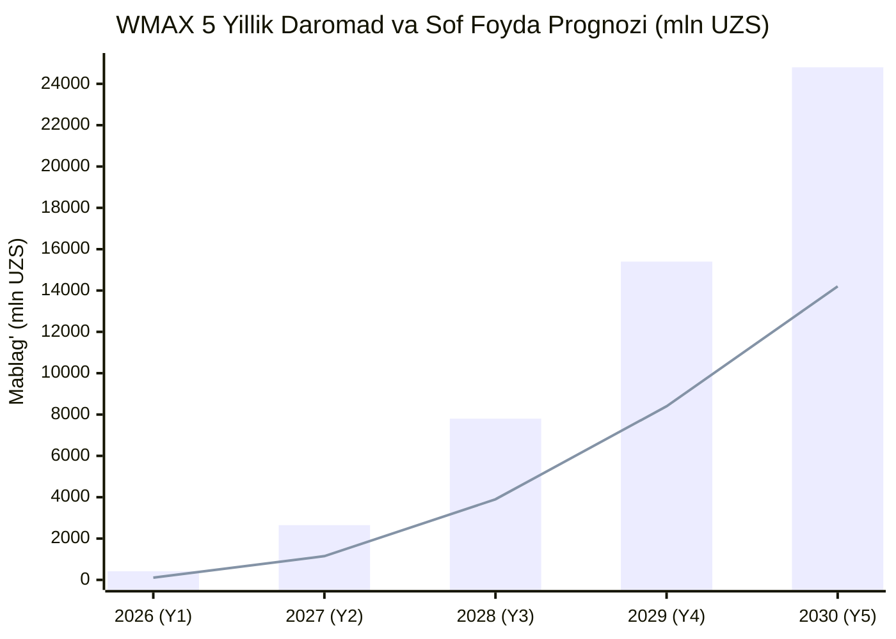

### Batafsil P&L (Foyda va Zararlar Hisoboti):

| Ko'rsatkich | 2026 (1-yil) | 2027 (2-yil) | 2028 (3-yil) | 2029 (4-yil) | 2030 (5-yil) |
|---|:---:|:---:|:---:|:---:|:---:|
| **Faol B2C Obunachilar** | 350 | 2,500 | 7,500 | 16,000 | 28,000 |
| **Hamkor Klinikalar (B2B)** | 3 | 18 | 55 | 110 | 180 |
| **Klinikadagi Faol Bemorlar** | 150 | 1,200 | 4,500 | 9,500 | 16,000 |
| **JAMI FAOL BEMORLAR** | **500** | **3,700** | **12,000** | **25,500** | **44,000** |
| | | | | | |
| **B2C Obuna Daromadi** | 248 mln | 1,770 mln | 5,310 mln | 11,328 mln | 19,824 mln |
| **B2B Litsenziya Daromadi** | 153 mln | 1,224 mln | 4,590 mln | 9,690 mln | 16,320 mln |
| **Qurilmalar Savdosi Marjasi** | 19 mln | 156 mln | 400 mln | 782 mln | 1,156 mln |
| **JAMI YILLIK TUSHUM** | **420 mln**<br/>*($32.8K)* | **3,150 mln**<br/>*($246K)* | **10,300 mln**<br/>*($804K)* | **21,800 mln**<br/>*($1.70M)* | **37,300 mln**<br/>*($2.91M)* |
| | | | | | |
| O'zgaruvchan xarajatlar (COGS) | 48 mln | 340 mln | 1,080 mln | 2,240 mln | 3,750 mln |
| **Yalpi Foyda (Gross Profit)** | **372 mln** | **2,810 mln** | **9,220 mln** | **19,560 mln** | **33,550 mln** |
| *Yalpi Foyda Marjasi* | *88.5%* | *89.2%* | *89.5%* | *89.7%* | *89.9%* |
| | | | | | |
| Operatsion xarajatlar (OPEX): | | | | | |
| — Dasturchilar va IT jamoasi | 180 mln | 720 mln | 1,800 mln | 3,200 mln | 4,800 mln |
| — Sotuv, Marketing va GTM | 70 mln | 550 mln | 1,600 mln | 3,400 mln | 5,200 mln |
| — Tibbiy ekspertlar & Support | 40 mln | 240 mln | 750 mln | 1,600 mln | 2,500 mln |
| — Yuridik, Ofis va Ma'muriy | 25 mln | 150 mln | 450 mln | 850 mln | 1,200 mln |
| **Jami OPEX** | **315 mln** | **1,660 mln** | **4,600 mln** | **9,050 mln** | **13,700 mln** |
| | | | | | |
| **EBITDA (Operatsion Foyda)** | **57 mln** | **1,150 mln** | **4,620 mln** | **10,510 mln** | **19,850 mln** |
| **EBITDA Marjasi** | **13.5%** | **36.5%** | **44.8%** | **48.2%** | **53.2%** |

---

# 12. Regulyatorlik, Yuridik Asos va Kiberxavfsizlik

## 12.1 Shaxsga Doir Ma'lumotlar To'g'risidagi Qonun (O'RQ-547)

O'zbekiston Respublikasining "Shaxsga doir ma'lumotlar to'g'risida"gi Qonuni 27-1-moddasiga muvofiq:
1. **Lokalizatsiya majburiyati:** O'zbekiston fuqarolarining shaxsiy va tibbiy (PHI) ma'lumotlari **faqat O'zbekiston Respublikasi hududida jismonan joylashgan serverlarda** yig'ilishi, tizimlashtirilishi va saqlanishi shart.
2. **Infratuzilma:** Production serverlari (PostgreSQL, TimescaleDB, API konteynerlari) Toshkent shahridagi milliy data-markazda joylashtiriladi.

## 12.2 Tashqi Sun'iy Intellekt (AI) Bilan Ishlashda PHI Anonimizatsiyasi

DeepSeek (Xitoy) yoki Gemini (AQSh) kabi xalqaro LLM API lariga so'rov yuborishda shaxsiy ma'lumotlar sizib chiqmasligi uchun qat'iy **de-identifikatsiya qoidasi** o'rnatilgan:

```python
# app/ai/guardrails.py
def build_anonymized_ai_payload(patient, vitals_summary):
    """Xorijiy LLM API larga yuborishdan oldin bemor shaxsini 100% tozalaydi.
    
    Yuborilmaydi: Ism, Familiya, Pasport, Manzil, Telefon, Oila a'zolari.
    Yuboriladi: Faqat yoshi, jinsi, XKT-10 kodi va 72 soatlik dinamik trendlar.
    """
    return {
        "demographics": {
            "age": patient.age,
            "sex": patient.sex
        },
        "clinical_context": {
            "icd10": patient.diagnosis_code, # Masalan: "I50.0"
            "active_substances": [m.inn for m in patient.medications]
        },
        "telemetry_deltas": vitals_summary
    }
```

---

# 13. Ijtimoiy Ta'sir (ESG) va Klinik Samara

WMAX faqat tijoriy dasturiy mahsulot emas, balki **O'zbekiston milliy sog'liqni saqlash tizimi uchun strategik ijtimoiy tashabbusdir**:

1. **O'lim holatlarini erta oldini olish:**
   - O'zbekistonda barcha o'lim holatlarining 60% dan ortig'i qon aylanish tizimi kasalliklariga to'g'ri keladi. WMAX erta dekompensatsiya signallari orqali to'satdan vafot etish xavfini **25–35 foizga kamaytirish** imkoniyatiga ega.
2. **Qishloq hududlarida tibbiyot tengligi (Inclusivity):**
   - Qishloq joylarida (OvaBMU, QVP) bitta patronaj hamshirasi bir necha mahalladagi 1,000 dan ortiq xonadonga qaraydi. WMAX hamshiraning 5 daqiqalik tashrifini saralab berish orqali eng og'ir bemorlarni birinchi navbatda qutqarishga yo'naltiradi.
3. **Migrant oilalarining xotirjamligi va ijtimoiy barqarorlik:**
   - Uzoqda yurgan millionlab vatandoshlarimiz ota-onalarining salomatligi haqida har kuni xotirjam axborot olib turishi oilaviy aloqalarni mustahkamlaydi va jamiyatda stressni kamaytiradi.

---

## 🎯 Yakuniy Xulosa

> **WMAX — bu qimmat tibbiy asbob emas, bu har bir xonadonga kirib boruvchi "Raqamli Hamshira va Himoya Zanjiri"dir.**  
> B2C modeli orqali biz darhol o'zini oqlaydigan, yuqori marjali va tez o'suvchi xususiy obuna daromadiga ega bo'lamiz. B2B modeli orqali esa davlat shifoxonalari va sug'urta tizimiga chuqur integratsiya qilinib, O'zbekiston bo'ylab 30 kunlik qayta kasalxonaga yotish asoratlarini keskin kamaytiramiz. Multi-tenancy va qat'iy javobgarlik zanjiri esa ushbu ikkala qanotning yagona, mustahkam poydevori hisoblanadi.
