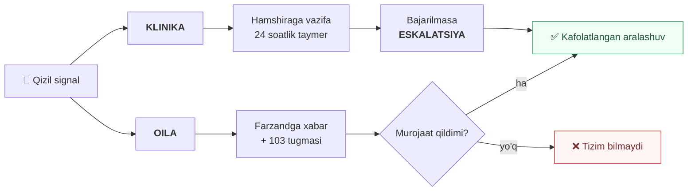

# WMAX — Ideologiya

> **Holat:** asos hujjat · 2026-09-21
> Bu hujjat **nima qurilishini emas, nima uchun shunday qurilishini** belgilaydi.
> Kod, sxema va interfeys bo'yicha har qanday qaror shu bandlarga tayanishi kerak.
> Bandga zid yechim — yechim emas.

---

## Bir jumlada

> Tizim **o'lchaydi va xabar beradi**.
> Tashxisni **odam qo'yadi**, javobgarlikni **muassasa oladi**.

---

## Mundarija

| Bo'lim | Mavzu |
|---|---|
| [A](#a--yadro) | Yadro — va'da, foydalanuvchi, soddalik |
| [B](#b--tuzilma) | Tuzilma — bemor, hisob, ulanish, rozilik, kirish |
| [C](#c--javobgarlik) | Javobgarlik — parvarish egasi |
| [D](#d--buzilmas-qoidalar) | **Buzilmas qoidalar** |
| [E](#e--pul) | Pul — obuna va tarif |
| [F](#f--ishonch-va-sifat) | Ishonch — kelib chiqish va sifat |
| [G](#g--twin-va-haqiqat-halqasi) | Twin va haqiqat halqasi |
| [H](#h--platforma) | Platforma — ikki oyna |
| [I](#i--bildirishnoma) | Bildirishnoma — vaqt zonasi, zaxira zanjiri |
| [J](#j--hayot-sikli) | Hayot sikli — o'lim |
| [K](#k--malumot-saqlash) | Ma'lumot saqlash — o'chirilmaydi |
| [—](#nima-uchun-shunday) | Eng ziddiyatli qarorlarning sababi |
| [—](#bu-hozirgi-koddan-nimasi-bilan-farq-qiladi) | Hozirgi koddan farqi |

---

# A — Yadro

### A1 · Ikki va'da, bitta dvigatel

Klinika **javobgarlik** sotib oladi. Oila **xabardorlik** sotib oladi.
Klinik yadro (baseline, z-score, circadian oyna) umumiy; mahsulot yuzasi,
matn va huquqiy da'vo boshqa-boshqa.



### A2 · B2C foydalanuvchisi — uzoqdagi farzand

Birlamchi foydalanuvchi **bemor emas**. U — Toshkentda yoki chet elda
ishlaydigan farzand: u to'laydi, u kuniga bir necha marta qaraydi.
Bemor faqat soatni taqadi va ilovani hech qachon ochmasligi mumkin.

Natija: B2C ilovasi — **qarovchi ilovasi**. Onboarding, to'lov,
bildirishnoma — hammasi farzand tomonida.

### A3 · Soddalik — qattiq cheklov

Har bir qarorda **"oddiy odam tushunadimi?"** savoli **veto huquqiga** ega.
Texnik jihatdan to'g'ri, lekin tushunarsiz yechim — rad etiladi.

---

# B — Tuzilma

### B1 · Bemorning egasi yo'q

`patients` jadvalida `tenant_id` **yo'q**. Tenantlar bemorga **a'zolik**
orqali ulanadi. Shuning uchun klinikadan oilaga o'tishda yozuv ko'chmaydi,
nusxalanmaydi va tarix uzilmaydi.

```
Otabek Ro'zmetov (bitta yozuv, egasiz)
  ▲
  ├─ Urganch OvaBMU    care       01-10 → 02-24   (yopiq)
  └─ Dilnoza, Sardor   household  01-10 → ochiq
```

### B2 · Hisob ≠ bemor

Bular **ikki xil identifikatsiya masalasi** va aralashtirilmaydi.

| | Hisob | Bemor |
|---|---|---|
| Kim | Farzand, hamshira, shifokor | Keksa ota-ona |
| Kalit | **Telefon + SMS** (qat'iy) | Ism + tug'ilgan sana (+ telefon, agar bor) |
| Moslik | Aniq | **Yumshoq — tizim so'raydi, o'zi qo'shmaydi** |

JSHSHIR ustuni sxemada bor, lekin hozir **bo'sh**. Odamlar uni ishlatishni
bilmaydi va tasdiqlash qiyin. Keyin to'ldiriladi va kuchli kalitga aylanadi.
Google va Telegram ham **hisob qatlamiga** qo'shiladi — bemor modeliga tegmaydi.

### B3 · Ikki ulanish mexanizmi

```
B2C — SHAXSIY                    B2B — INSTITUTSIONAL
taklif orqali                    klinika biriktiradi
muddatsiz                        chiqarishda yopiladi

Dilnoza — to'lovchi              Urganch OvaBMU (tenant)
Sardor  — qarovchi                 Zilola — hamshira
                                   Islom  — shifokor
```

> Qarovchi **hech qachon** tenant orqali kelmaydi.
> Hamshira **hech qachon** taklif orqali kelmaydi.
> Ikkalasi bitta jadvalga tiqilsa — chalkashlik qaytadi.

### B4 · Bemor rozilik beradi

Farzand ro'yxatdan o'tkazadi, lekin bemorga SMS boradi va u **qabul qiladi
yoki rad etadi**. Istalgan paytda bekor qila oladi. "Meni kim kuzatmoqda?"
ekrani doim mavjud.

Bemor telefonsiz bo'lsa — hamshira yoki shifokor og'zaki rozilikni
tasdiqlaydi va bu **jurnalga tushadi**: kim tasdiqladi, qachon, qanday usulda.

### B5 · Ikki rozilik, ikki alohida bekor qilish

Oilaga ruxsat va klinik kuzatuv — **boshqa-boshqa rozilik**.

| | Oilaga ruxsat | Klinik kuzatuv |
|---|---|---|
| Tabiati | Shaxsiy, ixtiyoriy | Davolash rejasining qismi |
| Bekor qilish | Bir bosishda, hech kim to'smaydi | **Davolashdan bosh tortish** |
| Oqibat | Qarovchi ko'rmaydi | Parvarish egasi yo'qoladi, va'da tushadi |
| Yozuv | Jurnalga | Jurnalga + klinika xabardor qilinadi |

Bemor davolashdan bosh tortishga haqli. Lekin bu boshqa hodisa: tasdiqlash
ekrani ko'rsatiladi va poliklinika xabardor qilinadi.

### B6 · Klinika ichida kirish javobgarlik bo'yicha

Tenant izolyatsiyasi yetarli emas — 300 bemorlik navbat ishlatib bo'lmaydi
va `F2` (navbat toza bo'lsin) buziladi.

| Rol | Ko'radi |
|---|---|
| Hamshira | O'z mahallalaridagi bemorlar |
| Oilaviy shifokor | O'z uchastkasi |
| Bosh shifokor | Butun klinika + hisobot |

Bu real tashkiliy tuzilmaga mos: O'zbekiston poliklinikasida har hamshira
aniq mahallalarga biriktirilgan.

> **Bitta mexanizm ikki ish qiladi:** chiqarishda kimga topshirishni
> aniqlaydi (M11 yo'naltirish) va kim ko'ra olishini belgilaydi.
> Ikkita alohida qoida yozilsa — ular bir-biridan ayrilib ketadi.

---

# C — Javobgarlik

### C1 · Bir vaqtda ko'pi bilan bitta parvarish egasi

Tizim har lahzada **ism bilan** javob bera olishi kerak: *"Hozir bu bemor
uchun kim navbatda?"*

Javob faqat ikki xil: **aniq bir muassasa** yoki **hech kim**.
"Yarim javobgar" degan holat yo'q — aynan shu holatda hamma
"boshqasi qaraydi" deb o'ylaydi.

**Qarovchi hech qachon parvarish egasi emas.** U xabardor odam, navbatchi emas.

### C2 · Va'da parvarish egasiga qarab ko'tariladi va tushadi

| Parvarish egasi | Qizil signal |
|---|---|
| Bor | Vazifa + 24s taymer + eskalatsiya |
| Yo'q | Xabar + 103 tugmasi, **vazifa yaratilmaydi** |

### C3 · Klinika nimani qabul qilayotganini ko'radi

Javobgarlik klinikada, demak qaror ham ularda. Ulanishdan **oldin**
ma'lumot sifati ko'rsatiladi: qurilma qayerdan, necha kun taqilgan,
ma'lumotsiz kunlar, anomaliyalar. Keyin klinika tanlaydi:

```
[Qabul qilaman — baseline ishlatiladi]
[Qayta o'rganaman — 7 kun kalibratsiya]
[Rad etaman]
```

### C4 · Litsenziya to'lanmasa — kuzatuv davom etadi, qabul to'xtaydi

`D2` (kuzatuv parvarish egasining huquqi bilan) va `C1` (klinika javobgar)
to'qnashadigan yagona joy. Yechim: bosim **tirik bemorga emas, qabul
klapaniga** qo'yiladi.

```
Litsenziya muddati tugadi · 40 bemor

✓ signal, vazifa, eskalatsiya — ishlaydi
✗ yangi bemor qabul qilinmaydi
✗ yangi qurilma biriktirilmaydi

→ mavjud bemorlar tabiiy ravishda chiqariladi
→ hech kim o'rtada qolmaydi
```

Davlat poliklinikasida byudjet kechikishi odatiy hol — va bemorlar
buning uchun javob bermaydi.

---

# D — Buzilmas qoidalar

> Bu beshtasi **muhokama qilinmaydi**. Ularga zid har qanday talab
> — talab emas, xato.

### D1 · Tashxis aytilmaydi

Tizim **nimani ko'rganini** aytadi, **nimani anglatishini** emas.

| ❌ Tashxis | ✅ O'lchov |
|---|---|
| "Yurak yetishmovchiligi kuchaymoqda" | "SpO₂ 5 kundan beri normangizdan past" |
| "Dekompensatsiya boshlandi" | "Ko'rsatkichlar sezilarli farq qilmoqda" |
| "Dorini oshirish kerak" | "Shifokorga murojaat qiling" |

Klinikada chiziqni **shifokor** ushlaydi — tizim unga dalil beradi.
Oilada shifokor yo'q, shuning uchun chiziqni **tizim** ushlashi shart.

### D2 · Klinik kuzatuv obunaga bog'liq emas

O'lchov oqimi va signal dvigateli **parvarish egasining** huquqi bilan
ishlaydi — oilaning obunasi bilan **emas**.

Oila to'lamasa, faqat **ularning ko'rinishi** o'zgaradi. Hamshira hech
narsa yo'qotmaydi.

### D3 · Kamida bitta javobgar doim xabardor

```
parvarish egasi bor  → hamshiraga HAR DOIM · oilaga obunaga qarab
parvarish egasi yo'q → oilaga HAR DOIM, bepul (bu xavfsizlik poli)
```

### D4 · Qizil signal va SOS hech qachon pul ortida emas

Obuna tugaganda bloklanadi: real vaqt holat, faollik, trend, tarix,
AI xulosa, PDF. **Qoladi:** qizil signalda xabar va SOS tugmasi.

Sabab: hamshira *biladi*, lekin oila *yetib boradi*. Qizil signal bizga
pul turmaydi — u kamdan-kam chiqadi. Lekin uni bloklash bir marta noto'g'ri
ketsa, butun mahsulotni tugatadi.

### D5 · Bajaruvchisi yo'q vazifa yaratilmaydi

Yolg'on xavfsizlik hissi — o'limga olib boradigan xato.

---

# E — Pul

### E1 · Obuna bemorga biriktiriladi

Tenantga emas, **bemorga**. Istalgan ulangan odam to'lay oladi;
hamma a'zo muddatni va tugash sanasini ko'radi.

Dilnoza bitta hisob bilan ota va onani kuzatadi → **ikki obuna**.

### E2 · B2B — faol bemor-kun + minimal majburiyat

Birlik — **bemor-kun**. U arenda uzunligining har qanday variantini
o'zi hal qiladi: 5 kun ham, 3 oy ham.

Minimal majburiyat **qurilmalar soniga** bog'langan.

```
20 soat · minimal 200 bemor-kun/oy

Sentabr  252 → 252 uchun to'lov
Oktabr   180 → 200 uchun to'lov (minimal ishladi)
Noyabr   410 → 410 uchun to'lov
```

> **Nega shunday:** faqat foydalanish bo'yicha to'lov **teskari turtki**
> yaratadi — byudjeti tor klinika kuzatuvni kamaytirib pul tejaydi.
> Faqat qurilma bo'yicha to'lov esa sotishni qiyinlashtiradi va
> past foydalanishda o'lik hisob beradi.

### E3 · Ma'lumotsiz kun sanaladi, lekin ochiq ko'rsatiladi

Qurilma band — biz uni boshqa bemorga bera olmaymiz. Lekin hisob-fakturada
alohida yoziladi: *"252 bemor-kun, shundan 31 kun ma'lumotsiz"*.

> Bu adolat uchun emas, **klinikaning huquqiy himoyasi** uchun:
> agar ular bizning hisob-faktura asosida davlatdan qoplama olsa,
> ma'lumotsiz kunlar ularning fraud xavfi bo'ladi.

### E4 · Bir narsa uchun ikki marta olinmaydi

Qurilmani kim bergan bo'lsa, o'sha hisoblaydi. Klinika ulanganda
"Premium + Shifokor" tarifi **ma'nosini yo'qotadi** (navbatchi allaqachon
bor) — avtomatik to'xtatiladi yoki pastga tushadi, sababi aytiladi.
### E5 · "Faol bemor-kun" — a'zolik ochiq VA qurilma biriktirilgan

Ikkala shart ham bajarilgan kalendar kunlari sanaladi.

```
01-10  a'zolik ochildi      — sanalmaydi (xizmat yo'q)
01-14  soat biriktirildi    ✓ birinchi kun
02-24  bemor chiqarildi     ✓ oxirgi kun
02-27  soat qaytarildi      — sanalmaydi

42 bemor-kun
```

Kechikkan qaytarish uchun to'lanmaydi. Qabul qilingan, lekin soat
berilmagan kunlar uchun ham to'lanmaydi.


---

# F — Ishonch va sifat

### F1 · Kelib chiqish yoziladi

Barcha o'lchov bir xil emas. Har qurilma biriktirilishi o'z darajasini
olib yuradi:

```
device_assignments
  provenance   clinic_issued | self_purchased | unknown
  supervised   true | false
  verified_by  kim tasdiqladi (hamshira ko'rdi / hech kim)
```

> Stsenariy: o'g'il soatni "sinab ko'rish uchun" 2 kun o'zi taqadi.
> Baseline ifloslanadi. Keyin klinika **buzuq normaga** ishonib
> qaror qabul qiladi.

### F2 · Sifat vazifa turini o'zgartiradi

Ishonib bo'lmaydigan ma'lumotdan **klinik majburiyat yaratilmaydi**.
Lekin bemor yashirilmaydi — so'ralgan harakat o'zgaradi:

```
🔴 Klinik — ishonchli ma'lumot
   → "Bemorga boring" · 24s taymer · eskalatsiya

🔧 Texnik — sifat past
   → "Soatni tekshiring" · taymer yo'q · eskalatsiya yo'q
```

> Sabab: bitta tartibsiz taqiladigan B2C soati hamshiraning butun
> navbatini zaharlaydi va u **butun tizimga** ishonmay qo'yadi —
> jumladan yaxshi jihozlangan klinika bemorlariga ham.

### F3 · Muhim narsa itaradi, panel faqat tafsilot uchun

Passiv panel ochilmaydi. Shifokorning o'zi kirib qarashiga tayanmaymiz.
### F4 · Attributsiya biriktirish oynasi bo'yicha, qurilma holatiga qarab emas

O'lchov **"hozir kim biriktirilgan"** ga emas, **o'z vaqt belgisi qaysi
biriktirish oynasiga tushsa** — o'shanga yoziladi. Aks holda oflayn bufer
kech sinxronlanganda bir bemorning o'lchovi boshqasining baseline'iga kiradi.

> ⚠️ **Qurilma reset'iga tayanib bo'lmaydi.** Galaxy Watch 4/5/6/7 da
> Samsung "Transfer watch to new phone" funksiyasini qo'shdi — u
> sozlama va ma'lumotni **saqlab qoladi**. Ustiga bufer uch joyda:
> soat, telefon Room DB, server navbati.
>
> Reset — gigiyena protsedurasi. **Xavfsizlik nazorati — biriktirish oynasi.**

**Oynaga tushmagan o'lchovlar** (`orphan_readings`): standart holat — rad
etish, hech kimga yozilmaydi. Hamshira ularni ko'radi va kerak bo'lsa
**biriktirishni orqaga suradi** — bitta harakat, barcha o'lchovni qamraydi.

| Himoya | Nima qiladi |
|---|---|
| Cheklangan nomzodlar | Faqat o'sha qurilma bilan shu vaqt atrofida bog'liq bemorlar |
| 14 kunlik muddat | Undan eskisi avtomatik tashlanadi — eslash emas, taxmin |
| `nurse_attributed` belgisi | Twin va tadqiqot uni **zaifroq dalil** deb biladi |
| Standart — rad etish | Harakatsizlik xavfsiz tomonga ishlaydi |


---

# G — Twin va haqiqat halqasi

### G1 · To'rt daraja ham quriladi

Ketma-ketlik **prioritet tanlovi emas, fizik bog'liqlik**: L3 ni L2
ma'lumotisiz qurib bo'lmaydi, chunki bashorat qiladigan model **haqiqiy
javoblardan** o'rganadi.

```
L1  KO'ZGU        baseline + profil                    → hozir
L2  O'LCHOV       aralashuvga HAQIQIY javob            → hozir
     ↓ 6–12 oy ma'lumot ← so'rovnoma shu yerda ishlaydi
L3  BASHORAT      belgilashdan OLDIN aytish            → ma'lumot yetganda
     ↓ klinik validatsiya
L4  SIMULYATSIYA  PK/PD, doza-javob egri chiziqlari    → tadqiqot
```

Yetkaziladigan mahsulot — L1 + L2. Lekin **ma'lumot skeleti L4 gacha
o'ylanadi**, keyin qayta qurmaslik uchun.

### G2 · Tarix so'ralmaydi — o'stiriladi

Ro'yxatdan o'tish **2 daqiqa**: ism, yosh, jins, telefon, va 5 ta keng
tugma (yurak · diabet · o'pka · bosim · bilmayman).

```
Ro'yxat (2 daq)
  ↓
Soat taqildi → BASELINE o'z-o'zidan o'sadi (7 kun)
  ↓            ← eng qimmatli qism, hech kim kiritmaydi
Farzand vaqti bo'lganda qo'shadi (dori, allergiya, vazn)
  ↓
KLINIKA ulanadi → ICD-10, epikriz, retsept, gospitalizatsiya
  ↓                ← twin shu yerda haqiqiy to'ladi
```

### G3 · So'rovnoma — twinning dvigateli

Qo'shimcha funksiya emas. Tizim bashorat qiladi, lekin **haqiqatda nima
bo'lganini hech kim yozmaydi** — so'rovnoma aynan shu bo'shliqni yopadi.

Chegirma bilan rag'batlantiriladi: ixtiyoriy so'rovnomani hech kim
to'ldirmaydi.

**Mexanika:**
- 3 ta savoldan ko'p emas
- Javob tugmalari **10 soniyadan keyin** ochiladi — kutgan odam o'qiydi
- Har savol bo'yicha vaqt alohida yoziladi
- Savollardan biri **teskari ma'noda** yoziladi — o'qimagan odam ziddiyat qoldiradi
- Tekshiriladigan langar bor: *"Kasalxonaga murojaat qildingizmi?"* → `patient_admissions` bilan solishtiriladi

### G4 · Sifatsiz javob modelga kirmaydi, lekin chegirma beriladi

Chegirma — **to'ldirgani uchun**, javobning mazmuni uchun emas.

```
duration · straightline · fact_conflict
        ↓
quality: trusted | weak | rejected
        ↓
rejected → modelga kirmaydi
        → chegirma ✓ beriladi
```

Aks holda mijoz ham jahli chiqadi, ma'lumot ham yomon bo'ladi.

### G5 · Savol kuzatilgan fakt haqida bo'lsin

| ❌ Rost javob kelmaydi | ✅ Keladi |
|---|---|
| "Otangizni har kuni ko'rdingizmi?" | "Otangiz oxirgi 3 kunda ovqatni kamaytirdimi?" |
| "Dorilarni vaqtida berdingizmi?" | "Qaysi dorilar hozir uyda tugagan?" |

Birinchi ustunda odam **o'zini** baholaydi — va o'zini yomon ko'rsatmaydi.

**Eslash oynasi qisqa bo'lsin** — "oxirgi 3 kun", "o'tgan oy" emas.
Odam bir oy oldingini eslamaydi va to'qiy boshlaydi.

---

# H — Platforma

### H1 · Ikki oyna, bitta emas

| Oyna | Nima uchun | Ma'lumot |
|---|---|---|
| **Tadqiqot** | Digital twin, model sifati, statistika | **Shaxssizlantirilgan**, barcha tenantlar |
| **Qo'llab-quvvatlash** | Muayyan muammoni hal qilish | To'liq, lekin **sabab + jurnal** bilan |

Twin qurish uchun **ma'lumot** kerak, **ism** emas:

```
Kerak                         Kerak EMAS
68 yosh, erkak, I50.0         Otabek Ro'zmetov
baseline HR 66, SpO₂ 97       +998 90 111 00 11
bisoprolol 5mg → HR −14       Urganch, Gulobod MFY, 42
```

### H2 · Har tenantlararo o'qish jurnalga yoziladi

Kim, kimga qaradi, qachon, nima sababdan. Bu cheklov emas — **himoya**.

---

# I — Bildirishnoma

### I1 · Ikki vaqt zonasi, ikki maqsad

| | Zona | Nima uchun |
|---|---|---|
| **Klinik vaqt** | Bemorning (`Asia/Tashkent`) | Circadian oyna, baseline, `no_data` — bularning hammasi **tananing ritmi** haqida |
| **Yetkazish** | Darhol, hech kim kutilmaydi | Qarovchi uyg'onganda ko'radi va bog'lana oladi |

Jim soat **yo'q** — xabar ushlab turilmaydi. Farq faqat telefonni
jiringlatishda:

| Signal | Ovoz |
|---|---|
| 🔴 Qizil · SOS | Jiringlaydi, "Bezovta qilmang" rejimini kesib o'tadi |
| 🟡 Sariq · eslatma · so'rovnoma | Jim — tray'da turadi |

### I2 · Qizil signal uchun zaxira zanjiri

`D3` (kamida bitta javobgar doim xabardor) bitta tashqi xizmatga bog'liq
bo'lmasligi kerak. Telegram O'zbekistonda cheklanishi mumkin, bot bloklanishi
mumkin, va Telegram "o'qildi" holatini bermaydi.

```
🔴 Qizil signal
  00:00  ilova push   → yuborildi
  00:02  ochilmadi    → Telegram
  00:04  yetkazilmadi → SMS
  00:07  javob yo'q   → ovozli qo'ng'iroq
  00:08  ✓ tasdiqlandi — zanjir to'xtaydi

→ har urinish jurnalga: qaysi kanal, qachon, natija
```

Faqat **qizil signal va SOS** uchun. Qolgan xabarlarga bitta kanal yetarli.

---

# J — Hayot sikli

### J1 · O'lim hech qachon avtomatik aniqlanmaydi

Uzoq `no_data` — odatiy hol: soat zaryadda, bemor unutgan, qishloqda
internet yo'q. Undan o'lim xulosasi chiqarish mumkin emas.

**Odam belgilaydi:** hamshira yoki oila. Oila belgilasa — hamshiraga
tasdiqlash uchun boradi.

### J2 · Belgilangan zahoti hamma narsa to'xtaydi

```
DARHOL TO'XTAYDI              QOLADI
✗ signal va vazifalar         ✓ ma'lumot (J3)
✗ bildirishnomalar            ✓ oila 90 kun ko'radi
✗ so'rovnomalar
✗ obuna va hisob-kitob        YARATILADI
✗ "soatni taqing" eslatmasi   🔧 qurilmani qaytarish vazifasi
```

> Dafn kunida *"Otabekning ko'rsatkichlari yaxshi!"* xabari — bu
> kechirilmaydigan xato. Shuning uchun to'xtatish **bitta joydan**
> boshqariladi, har bir xabar turida alohida emas.

O'lim — twin uchun **eng muhim natija ko'rsatkichi**. Shuning uchun u
yoziladi, yashirilmaydi.

---

# K — Ma'lumot saqlash

### K1 · O'chirilmaydi

Ma'lumot **yo'q qilinmaydi** — bu tibbiy yozuv. Sabablari:

- **Ekspertiza.** Nizo bo'lsa (*"tizim ogohlantirdimi? hamshira javob berdimi?"*) to'liq yozuvning o'zi himoya bo'ladi
- **Twin.** O'lim va qayta tushish — model o'rganadigan yagona haqiqiy natijalar
- **Qonun.** Tibbiy yozuvlar saqlanishi shart

Bu **rad etish emas, standart tibbiy amaliyot** — har qanday poliklinika
ham xuddi shunday javob beradi. Muhimi: buni **ro'yxatdan o'tishda** aytish,
so'ralganda emas.

### K2 · "O'chiring" odatda boshqa narsani anglatadi

| Bemor so'raydi | Biz qilamiz |
|---|---|
| "Qizim ko'rmasin" | Qarovchi ruxsati bekor (`B5`) |
| "Meni kuzatmang" | Kuzatuvdan bosh tortish (`B5`) |
| "Xabar yubormang" | Barcha bildirishnoma to'xtaydi |
| "Hisobimni yoping" | Hisob yopiladi, kirish yo'q |
| "Ma'lumotni yo'q qiling" | ❌ Tibbiy yozuv — saqlanadi |

### K3 · Hajm — bo'linish hozir, siqish keyin

```
1 bemor · 5 daqiqada 1 o'lchov = ~105 000 qator/yil (~130 bayt)

 1 000 bemor →  ~14 GB/yil     ← muammo emas
10 000 bemor → ~140 GB/yil     ← shu yerdan qaror kerak
```

Normalizatsiya demografiyani hal qiladi (ism bir marta, qolgani
`patient_id` bilan). Asosiy hajm — o'lchovlarda.

**Oyma-oy bo'linish (partitioning) hozir qo'yiladi** — keyin qo'shish qimmat.
Lekin hech narsa siqilmaydi va tashlanmaydi; qaror kerak bo'lganda ma'lumot
allaqachon bo'lingan bo'ladi va tanlov oson bo'ladi.

---

# Nima uchun shunday

Eng ziddiyatli uchta qarorning sababi.

### Nega bemorning egasi yo'q

Egalik modeli sodda ko'rinadi (`patients.tenant_id NOT NULL`), lekin
klinikadan oilaga o'tishda ikki yomon variantdan birini majbur qiladi:
yozuvni **ko'chirish** (klinika tarixni yo'qotadi) yoki **nusxalash**
(ikkilanish, ikki baseline, ikki haqiqat).

A'zolik modelida bemor bitta qoladi, tarix uzilmaydi, va "kim ko'ra oladi"
savoli vaqt bo'yicha aniq javobga ega.

### Nega ikki va'da, bir emas

Ular **to'lov usuli bilan emas, eng muhim o'lchov bilan** farq qiladi:
*qizil signal chiqqanda kim javob beradi?*

Agar B2C ni B2B kabi ko'rsatsak — bajaruvchisi yo'q vazifa yaratamiz va
oilaga yolg'on xavfsizlik sotamiz. Agar B2B ni B2C kabi ko'rsatsak —
javobgarlik zanjirini yo'qotamiz va Muammo 11 ni yopmaymiz.

### Nega xavfsizlik pul ortida emas

Obuna tugagani uchun odam vafot etsa — bu bizning qurgan xavfimiz.
Huquqiy jihatdan himoya qilib bo'lmaydi, axloqiy jihatdan ham.

Va amaliy: qizil signal kamdan-kam chiqadi, ya'ni uni bepul berish
bizga deyarli hech narsa turmaydi. Lekin bir marta noto'g'ri ketsa —
mahsulot tugaydi.

---

# Bu hozirgi koddan nimasi bilan farq qiladi

| Hozir | Ideologiya bo'yicha |
|---|---|
| `patients.tenant_id` bor (nullable, hech kim yozmaydi) | **Yo'q** — o'rniga `patient_memberships` |
| `subscriptions.tenant_id` — tenantga bitta obuna | Obuna **bemorda** |
| `get_or_create_tenant_for_user()` — tenant o'qish paytida yaratiladi | Tenant **avval keladi**, u foydalanuvchi va bemorga egalik qiladi |
| JWT da `tenant_id` yo'q | Bor — va repozitoriy darajasida majburiy filtr |
| `get_worklist()` barcha bemorlarni qaytaradi | Faqat a'zolik orqali ko'rinadiganlar |
| Imkoniyat bitta obunadan | **Ikki manba**: parvarish egasi (klinik oqim) + oila (ko'rinish) |
| AI prognoz ikkala portalga bir xil matn | Klinikaga **xulosa**, oilaga **o'lchov** |
| Rozilik tushunchasi yo'q | `patient_consents` — kim, qachon, qanday usulda |
| Ma'lumot kelib chiqishi yozilmaydi | `device_assignments.provenance` |
| Signal sifatidan qat'i nazar vazifa | Sifat **vazifa turini** belgilaydi |
| Haqiqat halqasi yo'q | So'rovnoma + `patient_admissions` bilan solishtirish |

---

## Keyingi qadam

Ideologiya yopildi — ochiq savol qolmadi.

Keyingisi: **ma'lumot oqimlari**. Oltita oqim shu bandlardan chiziladi:

| # | Oqim | Qaysi bandlardan |
|---|---|---|
| 1 | Bemor paydo bo'lishi | `B2` `B4` `B5` `G2` |
| 2 | O'lchov yo'li | `F1` `F2` `F4` |
| 3 | Signal va javobgarlik | `C1` `C2` `D3` `D5` `I1` `I2` |
| 4 | Chegara kesib o'tish | `B1` `B3` `C3` `E4` |
| 5 | Pul va huquq | `D2` `D4` `E1`–`E5` `C4` |
| 6 | Twin va haqiqat halqasi | `G1`–`G5` `J2` `H1` |
