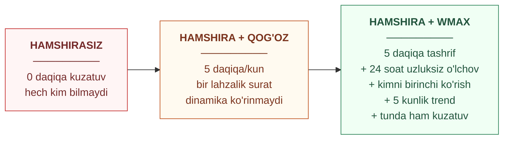
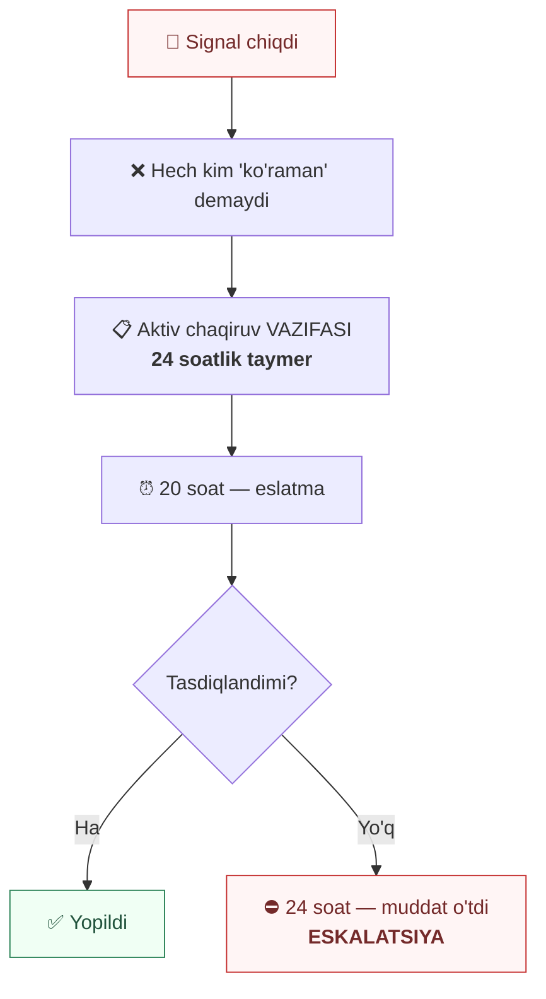
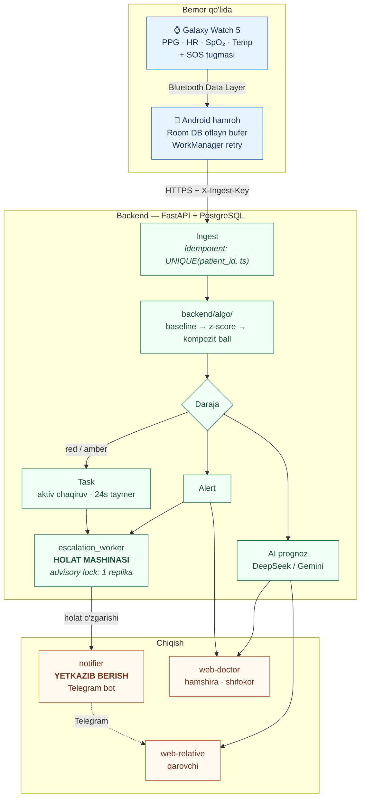
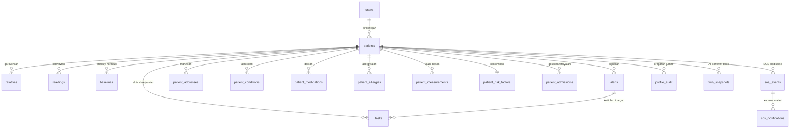
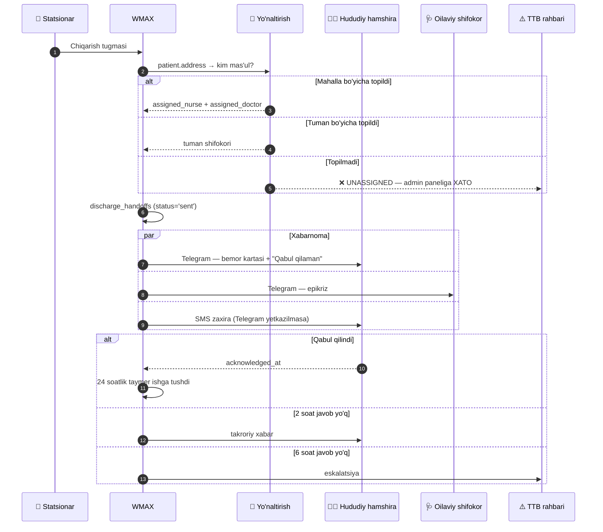
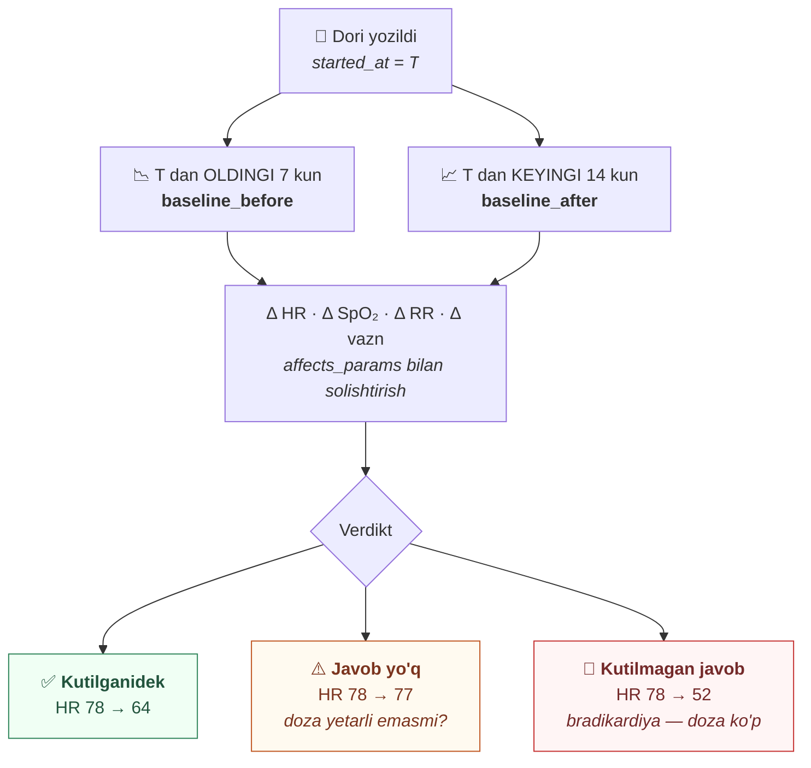

# WMAX — Texnik Hujjat

> **Umummilliy AI Xakaton, Xorazm · Ma'mun universiteti**
> **Trek:** Sog'liqni saqlash · **Muammolar:** 11 va 12
>
> Bu — loyihaning **texnik asosiy hujjati**.
>
> | Hujjat | Mazmuni |
> |---|---|
> | **`WMAX.md`** (shu) | Muammo, klinik dvigatel, arxitektura, ma'lumot modeli, xavfsizlik |
> | [`BUSINESS_MODEL.md`](./BUSINESS_MODEL.md) | B2C / B2B segmentlari, obuna, qurilma inventari, multi-tenancy |
> | [`DISASTER_RECOVERY.md`](./DISASTER_RECOVERY.md) | Operatsion runbook (RTO/RPO, tiklash) |

---

## Mundarija

| # | Bo'lim |
|---|---|
| 1 | [Muammo va yechim](#1-muammo-va-yechim) |
| 2 | [Foydalanuvchilar](#2-foydalanuvchilar) |
| 3 | [Klinik dvigatel](#3-klinik-dvigatel) |
| 4 | [Arxitektura](#4-arxitektura) |
| 5 | [Ma'lumot modeli](#5-malumot-modeli) |
| 6 | [Xavfsizlik](#6-xavfsizlik) |
| 7 | [Ishga tushirish](#7-ishga-tushirish) |
| 8 | [Nima tayyor](#8-nima-tayyor) |
| 9 | [Nima qolgan](#9-nima-qolgan) |
| 10 | [Ma'lum cheklovlar](#10-malum-cheklovlar) |

---

# 1. Muammo va yechim

## 1.1 Ikki muammo

### Muammo 11 — uzilgan parvarish zanjiri

> Statsionardan (OvaBMU) chiqarilgan og'ir bemorlar uchun **hududiy oilaviy
> shifokorga avtomatik xabarnoma yo'q**: bemor uyga qaytgach, davomiy
> parvarishlash uziladi va holatni kuzatish o'z-o'ziga qoladi.

### Muammo 12 — individuallashtirilmagan davolash

> Surunkali kasalliklar (diabet, yurak yetishmovchiligi) bilan og'rigan bemorlar
> uchun **individuallashtirilgan davolash rejimi yo'q**: haqiqiy bemorga dori
> belgilashdan oldin uning tanasida qanday ta'sir ko'rsatishini **virtual
> muhitda tekshirish** imkoniyati mavjud emas.

---

## 1.2 Yechimning yadrosi — hamshiraning 5 daqiqasini 24 soatga aylantirish

**Bu — loyihaning eng kuchli qismi.** Uni aniq tushunish kerak.

Og'ir bemor chiqarilgandan keyin **hududiy hamshira** zimmasiga tushadi.
Qoidaga ko'ra u bemorni **har kuni ko'rishi** kerak. Amalda:

| Haqiqat | Oqibat |
|---|---|
| Hamshira 24/7 kuzatmaydi | Tunda, ertalab — hech kim yo'q |
| Tashrif buyursa ham — kuniga **~5 daqiqa** | Bir lahzalik surat, dinamika emas |
| Uning zimmasida o'nlab bemor | Kimni birinchi ko'rish kerakligi noma'lum |
| Yozuv — qog'ozda, xotiradan | Trendni ko'rib bo'lmaydi |

Soat bu muammoni **hamshirani almashtirib emas, uni kuchaytirib** hal qiladi:



**Kalit fikr:**
> Soat hamshiraning o'rnini bosmaydi. U hamshiraning 5 daqiqalik tashrifini
> **maqsadli** qiladi: qaysi bemorga borish, nimaga qarash, nima o'zgargan.

Va shu bilan birga **Muammo 11 ni yopadi**: chiqarish hodisasi avtomatik
ravishda hududiy hamshira va oilaviy shifokorga topshiriq bo'lib yetadi,
bajarilishi kuzatiladi.

## 1.3 Ish oqimi — asosiy qiymat

Bu loyihani "yana bir dashboard" dan ajratadigan narsa:



Tizim signal beribgina qolmaydi — **javobgarlikni kuzatadi**.

---

# 2. Foydalanuvchilar

| Kim | Portal | Nima ko'radi | Til |
|---|---|---|---|
| **Hududiy hamshira** | `web-doctor` | Kunlik tashrif ro'yxati, prioritet bo'yicha saralangan. Kimni birinchi ko'rish kerak | Amaliy |
| **Oilaviy shifokor** | `web-doctor` | Klinik qaror: baseline tasdiqlash, dori, tashxis, trend | Klinik |
| **Yaqin kishi (qarovchi)** | `web-relative` | "Holat yaxshi / e'tibor talab qiladi / xavf" + amaliy tavsiya. **Tashxis ko'rsatilmaydi** | Oddiy |
| **Bemor** | soat + Telegram | SOS tugmasi, o'z ko'rsatkichlari | Eng oddiy |

**Muhim qoida:** backend **tayyor jumla qaytarmaydi** — faqat i18n kalitini
(`rec.contact_today`, `state.good`). Tarjima frontendda, uz/ru/en.

---

# 3. Klinik dvigatel

## 3.1 Shaxsiy norma, umumiy chegara emas

Umumiy chegaralar (SpO₂ < 90%, puls > 100) 68 yoshli yurak yetishmovchiligi
bemori uchun ma'nosiz — uning "normal"i boshqa.

1. **5–7 kun kuzatish** → shaxsiy baseline (`median` + `MAD`, parametr bo'yicha)
2. **Circadian oyna** — `Asia/Tashkent` bo'yicha 4 darcha: `0` = 00–06,
   `1` = 06–12, `2` = 12–18, `3` = 18–24.
   Kechasi past puls — norma; kunduzi o'sha puls — signal
3. **Yo'nalishli z-score** — `spo2`/`rmssd` faqat pasayish xavf;
   `hr`/`skin_temp`/`rr` faqat ko'tarilish
4. **3 ketma-ket oyna** (15 daqiqa) saqlansa — signal (shovqin filtri)

## 3.2 Domen qarorlari (o'zgartirilmaydi)

| Qaror | Qiymat |
|---|---|
| Holatlar | `green` · `amber` · `red` · `no_data` |
| Vaqt zonasi | `Asia/Tashkent` |
| Ketma-ket oynalar | 3 (15 daqiqa) |
| `no_data` chegarasi | 45 daqiqa o'lchov kelmasa (yashil emas!) |
| Ingest | Idempotent: `UNIQUE(patient_id, ts)` |
| IsolationForest | **Advisory** — qarorga ta'sir qilmaydi |
| Baseline tasdiqlash | **Odam halqada** — shifokor tasdiqlaydi |

## 3.3 Dori konteksti

Beta-blokator qabul qiladigan bemorda puls 52 — bu terapiya maqsadi, xavf emas.
`backend/algo/signal.py:apply_medication_context()` kutilgan farmakologik
effektni z-score'dan 0.5 koeffitsient bilan chegiradi.

> ⚠️ **Absolyut chegaralar (`CRITICAL_HR_AT_REST`, `CRITICAL_SPO2`) hech qachon
> yumshatilmaydi.** Beta-blokatorga qaramay puls 33 — bu xavf.

---

# 4. Arxitektura



## 4.1 Mas'uliyat bo'linishi

| Komponent | Vazifa | **Qilmaydi** |
|---|---|---|
| `escalation_worker` | Holat mashinasi: `reminded_at`, `escalated_at`, `no_data` signal | Xabar yubormaydi |
| `notifier` | Yetkazib berish: holat o'zgarishini o'qib, Telegram'ga | Holatni o'zgartirmaydi |

Ikki jarayon bir xil qatorga yozmaydi — poyga yo'q.

## 4.2 Modullar

| Papka | Texnologiya | Vazifa |
|---|---|---|
| `backend/app/` | FastAPI, SQLAlchemy 2, Pydantic v2 | REST API, ingest, bemorlar, aktiv chaqiruv |
| `backend/algo/` | NumPy, SciPy, scikit-learn | Circadian oynalar, yo'nalishli z-score, kompozit xavf |
| `backend/alembic/` | Alembic | **Sxema migratsiyalari — yagona haqiqat** |
| `web-doctor/` | React 19, TS, Vite, Recharts | Hamshira va shifokor ish stansiyasi |
| `web-relative/` | React 19, TS, Vite | Qarovchi mobil portali |
| `wear/` | Kotlin, Health Services, Room | Soat + telefon ilovalari |
| `notifier/` | Python, httpx, APScheduler | Telegram yetkazib berish |
| `scripts/seed_demo.py` | Python, ORM | Demo ma'lumot (SQL emas!) |

---

# 5. Ma'lumot modeli

## 5.1 Sxema — faqat ORM'dan

> **Muhim qoida:** sxemaning yagona haqiqati — `backend/app/models/` (SQLAlchemy ORM).
> `contracts/schema.sql` **o'chirilgan**. Qo'lda yozilgan SQL ORM bilan ayrilib
> ketib, uchta bir-biriga zid manba hosil qilgan edi.

```bash
# Sxemani o'zgartirish
cd backend
alembic revision --autogenerate -m "nima o'zgardi"
# → migratsiyani KO'RIB CHIQING → commit

# Qo'llash (konteyner ishga tushganda avtomatik)
alembic upgrade head

# ORM ↔ migratsiya farqini tekshirish (CI'da ham)
alembic check
```

Migratsiyalar Postgres `initdb` mount'i orqali emas, `backend/entrypoint.sh`
orqali qo'llanadi — `initdb` faqat **yangi** volume'da ishlaydi va mavjud
o'rnatishni jimgina eski sxemada qoldirardi.

## 5.2 Jadvallar (20 ta)



**Yadro:** `users` · `patients` · `relatives` · `readings` · `baselines` ·
`alerts` · `tasks` · `notifications` · `refresh_tokens`

**Bemor profili:** `patient_addresses` · `patient_conditions` ·
`patient_medications` · `patient_allergies` · `patient_measurements` ·
`patient_risk_factors` · `patient_admissions`

**SOS:** `sos_events` · `sos_notifications`

**Audit va twin:** `profile_audit` · `twin_snapshots`

## 5.3 Muhim tafsilotlar

| Jadval | Nima uchun muhim |
|---|---|
| `patient_addresses` | Struktura + GPS + **orientir** ("ko'k darvoza, maktab ro'parasida"). Qishloqda ko'cha nomi ishonchsiz |
| `patient_medications.affects_params` | Dori qaysi fiziologik parametrga ta'sir qiladi — signal dvigateli shunga qarab z-score'ni yumshatadi |
| `patient_measurements` | **Vazn dinamikasi** — yurak yetishmovchiligida suyuqlik yig'ilishining birinchi belgisi |
| `sos_events.address_snapshot` | Hodisa paytidagi manzil **ko'chirib** yoziladi, havola emas — tibbiy-huquqiy hujjat |
| `profile_audit` | Kim, qachon, nimani o'zgartirdi. Faqat `INSERT` |

---

# 6. Xavfsizlik

## 6.1 Rollar

```
AuthRole = doctor | nurse | admin | relative | patient
CLINICIAN_ROLES = {doctor, nurse, admin}
```

| Dependency | Kimni qabul qiladi |
|---|---|
| `get_current_user` | Faqat klinik xodim (`relative` → 403) |
| `get_current_relative` | Faqat qarovchi |
| `get_current_patient` | Faqat bemor |
| `get_current_principal` | Har qanday autentifikatsiyalangan (`/auth/me`) |
| `require_clinician` | `doctor`, `nurse`, `admin` |
| `require_doctor` | `doctor`, `admin` |

## 6.2 Maydon darajasidagi ruxsat

`backend/app/auth/field_policy.py` — deklarativ jadval, endpoint'lar bo'ylab
`if role ==` tarqatilmaydi.

| Ma'lumot | Bemor | Qarovchi | Hamshira | Shifokor |
|---|:--:|:--:|:--:|:--:|
| Manzil, orientir | qisman | ✏️ | ✏️ | ✏️ |
| Aloqa, til | ✏️ | ✏️ | ✏️ | ✏️ |
| Vazn, bosim | ✏️ | ✏️ | ✏️ | ✏️ |
| Allergiya | ✏️ | ✏️ | ✏️ | ✏️ |
| Dorilar | 👁 | 👁 | ✏️ | ✏️ |
| Tashxis (ICD-10) | 👁 | 👁 | 👁 | ✏️ |
| Faza, baseline tasdiq | ✗ | ✗ | 👁 | ✏️ |

**Deny-by-omission:** rolni ro'yxatga qo'shishni unutish — ruxsatni **rad qiladi**,
bermaydi. Klinik tizim uchun to'g'ri yo'nalish.

## 6.3 Majburiy sozlamalar

`ENV=production` da quyidagilar bo'lsa **ilova ishga tushmaydi**
(`validate_production_settings()`):

| Sozlama | Talab |
|---|---|
| `JWT_SECRET` | 32+ belgi, placeholder emas |
| `DATABASE_URL` | `change_me` bo'lmasin |
| `ENABLE_DEMO_ACCOUNTS` | `false` |
| `INGEST_API_KEY` | bo'sh bo'lmasin |

## 6.4 Boshqa choralar

- **Ingest:** `X-Ingest-Key` header (aks holda istalgan odam soxta signal chiqara oladi)
- **Login rate limit:** IP **va** telefon bo'yicha, `429` + `Retry-After`
- **Qarovchi PIN:** bcrypt `pin_hash`, demo PIN yo'q
- **Qarovchi havolasi:** URL tokeni **kalit emas** — JWT ham kerak, egalik tekshiriladi, TTL bor
- **Worker'lar:** Postgres advisory lock — faqat bitta replikada

---

# 7. Ishga tushirish

## 7.1 Docker

```bash
cp .env.example .env
# .env ga yozing: JWT_SECRET, INGEST_API_KEY, DEEPSEEK_API_KEY
docker compose up --build -d
```

| Servis | Manzil |
|---|---|
| API + Swagger | `http://localhost:8000/docs` |
| Shifokor portali | `http://localhost/` |
| Qarovchi portali | `http://localhost/r/` |
| Metrikalar | `http://localhost:8000/metrics` |

## 7.2 Lokal dasturchi

```bash
# Baza
docker compose up -d postgres

# Migratsiya (SQL fayl YO'Q — ORM'dan)
cd backend && alembic upgrade head && cd ..

# Demo ma'lumot (ORM orqali, 12 096 o'lchov)
python scripts/seed_demo.py

# API
uvicorn app.main:app --reload --app-dir backend

# Portallar
cd web-doctor   && npm run dev   # :5173
cd web-relative && npm run dev   # :5174
```

## 7.3 Demo hisoblar

| Kim | Login |
|---|---|
| Shifokor | `+998901234567` / `wmax123` |
| Hamshira | `+998901234568` / `wmax123` |
| Qarovchi | `+998901110011` / PIN `112233` |

> Faqat `ENABLE_DEMO_ACCOUNTS=true` bo'lganda ishlaydi.

## 7.4 Testlar

```bash
pytest -q                                  # 121 test
cd backend && alembic check                # ORM ↔ migratsiya
cd web-doctor && npx tsc --noEmit && npm run build
```

## 7.5 AI provayder

```bash
AI_PROVIDER=deepseek              # yoki gemini
DEEPSEEK_API_KEY=sk-...
DEEPSEEK_MODEL=deepseek-chat      # yoki deepseek-reasoner
```

Kalit bo'lmasa — lokal evristik prognozga tushadi, ilova ishlaydi.

---

# 8. Nima tayyor

```
✅ pytest                121 passed, 0 skip
✅ alembic check         No new upgrade operations detected
✅ upgrade/downgrade     to'liq aylanma
✅ .sql fayllar          loyihada birorta ham yo'q
✅ frontend build        mock'lar produksiya bundle'ida yo'q
```

| Sohа | Holat |
|---|---|
| Klinik dvigatel (`backend/algo/`) | ✅ Baseline, z-score, trend, IsolationForest (advisory) |
| Ingest + idempotentlik | ✅ `X-Ingest-Key` bilan himoyalangan |
| Auth + RBAC | ✅ 5 rol, maydon darajasidagi ruxsat, audit |
| Aktiv chaqiruv + eskalatsiya | ✅ Holat mashinasi ishlaydi |
| Telegram yetkazib berish | ✅ 3 job: eskalatsiya, signal, `no_data` |
| Monitoring | ✅ `/metrics`, Prometheus, Grafana panellari |
| Sxema boshqaruvi | ✅ ORM → Alembic, CI'da drift tekshiruvi |
| AI (DeepSeek/Gemini) | ✅ Circuit breaker, fallback, token metrikasi |
| Bemor profili (manzil, dori, allergiya) | ✅ API + RBAC + audit |
| SOS | ⚠️ Zanjir bor, **yetkazib berish yo'q** (§9) |

---

# 9. Nima qolgan

## 🔴 Asosiy maqsad — Muammo 11 hali yopilmagan

Sarlavhadagi asosiy so'z — **"avtomatik xabarnoma"** — hali bajarilmagan.

```python
# backend/app/services/patient_service.py — hozirgi holat
task = await self.task_repo.create_task(
    doctor_id=doctor_id,   # ← TUGMANI BOSGAN shifokor (statsionar)
    ...                    #    Kerak: HUDUDIY hamshira + oilaviy shifokor
)
```

| # | Ish | Nima uchun |
|---|---|---|
| **M11-1** | `facilities` jadvali + `users.facility_id` + `serves_mahallas` | Statsionar va poliklinika shifokori hozir bir xil `role="doctor"` — tizim kimdan kimga topshirilayotganini bilmaydi |
| **M11-2** | `discharge_handoffs` jadvali | Chiqarish = **rasmiy topshirish akti**, sana emas |
| **M11-3** | **Hududiy yo'naltirish** — `route_to_family_doctor()` | `users.district` va `patients.district` bor, lekin **hech qachon bog'lanmaydi** |
| **M11-4** | **Avtomatik xabarnoma** (Telegram + SMS + panel) | Hozir `Task` qatori jimgina yoziladi |
| **M11-5** | "Qabul qildim" tasdig'i + eskalatsiya | Topshirish — ikki tomonlama akt |
| **M11-6** | Yo'naltirilmagan bemor → admin paneliga **xato** | Jim o'tkazib yubormaslik — bu aynan muammoning o'zi |

### Kerakli jadvallar

```sql
CREATE TABLE facilities (
    id       UUID PRIMARY KEY DEFAULT gen_random_uuid(),
    name     TEXT NOT NULL,
    kind     TEXT NOT NULL CHECK (kind IN ('hospital','ovabmu','polyclinic','fap')),
    region   TEXT NOT NULL,
    district TEXT NOT NULL,
    mahallas TEXT[] NOT NULL DEFAULT '{}'
);

ALTER TABLE users
    ADD COLUMN facility_id     UUID REFERENCES facilities(id),
    ADD COLUMN serves_mahallas TEXT[] NOT NULL DEFAULT '{}';

CREATE TABLE discharge_handoffs (
    id                  UUID PRIMARY KEY DEFAULT gen_random_uuid(),
    patient_id          UUID NOT NULL REFERENCES patients(id) ON DELETE CASCADE,

    from_facility       TEXT NOT NULL,
    from_department     TEXT,
    discharged_by       UUID REFERENCES users(id),
    discharged_at       TIMESTAMPTZ NOT NULL DEFAULT now(),

    to_facility         TEXT,
    assigned_doctor_id  UUID REFERENCES users(id),
    assigned_nurse_id   UUID REFERENCES users(id),
    routing_reason      TEXT,

    discharge_icd10     TEXT NOT NULL,
    discharge_summary   TEXT NOT NULL,
    red_flags           JSONB NOT NULL DEFAULT '[]'::jsonb,
    medications_at_discharge JSONB NOT NULL DEFAULT '[]'::jsonb,
    follow_up_days      SMALLINT NOT NULL DEFAULT 1,

    notified_at         TIMESTAMPTZ,
    acknowledged_at     TIMESTAMPTZ,
    acknowledged_by     UUID REFERENCES users(id),
    first_contact_at    TIMESTAMPTZ,
    escalated_at        TIMESTAMPTZ,
    status              TEXT NOT NULL DEFAULT 'sent'
        CHECK (status IN ('sent','acknowledged','in_progress','completed','escalated','failed'))
);
```

### Xabarnoma zanjiri



---

## 🔴 Muammo 12 — birinchi qadam (L1)

"Virtual muhitda tekshirish" — katta va'da. Halol bosqichlar:

| | Nima | Hozir mumkinmi |
|---|---|:--:|
| **L0** | Qaysi dori qaysi parametrga ta'sir qiladi | ✅ `affects_params` bor |
| **L1** | Dori yozilgandan keyin **shu bemorda** haqiqiy ta'sirni o'lchash | ✅ **HOZIR** |
| **L2** | Populyatsiya priori ("bisoprolol 5mg → HR −12±5 bpm") | ⏳ 20–30 bemordan keyin |
| **L3** | Belgilashdan **oldin** bashorat — M12 ning javobi | ⏳ L2 dan keyin |
| **L4** | To'liq PK/PD simulyatsiya | ❌ tadqiqot, hackathon emas |

### L1 mexanizmi — hozir qurish mumkin



```sql
CREATE TABLE medication_responses (
    id              UUID PRIMARY KEY DEFAULT gen_random_uuid(),
    medication_id   UUID NOT NULL REFERENCES patient_medications(id) ON DELETE CASCADE,
    patient_id      UUID NOT NULL REFERENCES patients(id) ON DELETE CASCADE,
    baseline_from   TIMESTAMPTZ NOT NULL,
    baseline_to     TIMESTAMPTZ NOT NULL,
    response_from   TIMESTAMPTZ NOT NULL,
    response_to     TIMESTAMPTZ NOT NULL,
    observed_effects JSONB NOT NULL DEFAULT '{}'::jsonb,
    verdict         TEXT CHECK (verdict IN ('as_expected','no_response','unexpected','insufficient_data')),
    confidence      REAL,
    computed_at     TIMESTAMPTZ NOT NULL DEFAULT now(),
    reviewed_by     UUID REFERENCES users(id),
    reviewed_at     TIMESTAMPTZ,
    clinical_note   TEXT
);
```

**`affects_params` ni miqdoriyga o'tkazish kerak:**

```python
# Hozir (simulyatsiya uchun yaroqsiz)
{"hr": "lowers"}

# Kerak
{"hr_mean": {"direction": "lowers", "expected_pct": 15.0,
             "onset_days": 3, "steady_state_days": 7,
             "source": "literature"}}   # literature → population → personal
```

---

## 🟠 Texnik qarzlar

| # | Muammo | Fayl |
|---|---|---|
| **P1** | **SOS hech kimga yetib bormaydi** — `sos_notifications` `delivered=False` yotadi, notifier'da SOS job yo'q | `notifier/main.py` |
| **P2** | SOS eskalatsiya taymerlari (2/5/15 daq) qurilmagan | `backend/app/workers/` |
| **P3** | Redis limiter: paket `requirements.txt` da yo'q + **sinxron** klient async yo'lda event loop'ni bloklaydi | `backend/app/core/rate_limit.py` |
| **P4** | Wear release build emulyator manziliga uriladi (`buildConfigField` yo'q) | `wear/phone/build.gradle.kts` |
| **P5** | `openapi.yaml` 20+ endpoint orqada — frontend tiplari qo'lda yozilyapti | `contracts/openapi.yaml` |
| **P6** | Seed baseline hisoblamaydi → demo hammasi yashil ko'rinadi | `scripts/seed_demo.py` |
| **P7** | Token'lar `localStorage` da · `test_api.py` skip naqshi buzilishni yashiradi | frontend, testlar |

---

# 10. Ma'lum cheklovlar

> Bularni bilib turib qaror qabul qilish kerak — aks holda ular loyihani
> keyinroq to'xtatadi.

## 10.1 Bilak PPG SpO₂ klinik ishonchli emas

| Sharoit | Ta'sir |
|---|---|
| Harakat | Xato o'qish |
| **Periferik qon aylanishi yomon** | Aniqlik keskin tushadi |
| Sovuq qo'l | O'lchab bo'lmaydi |

**Paradoks:** yurak yetishmovchiligi bemorlarida aynan periferik qon aylanishi
buzilgan — tizim eng kerak bo'lgan bemorlarda eng noaniq.

**Chora:** SpO₂ og'irligini pasaytirib, HR / HRV / RR ga ko'proq tayanish
(ular bilakda ancha ishonchli).

## 10.2 Teri harorati ≠ tana harorati

Baseline ~34.2 °C — bu teri. Xorazm yozi +45°, qishi −5° → **mavsumiy drift**
baseline'ni bosib ketadi. Circadian oyna kunlik o'zgarishni ushlaydi, mavsumiyni emas.

## 10.3 Baseline kasal holatda quriladi

Chiqarilgan bemor birinchi hafta **barqaror emas**. Shu davrda o'rganilgan
"norma" — aslida kasal holat. Bemor tuzalsa → yolg'on signal; sekin yomonlashsa
→ yangi yomon holat "norma" bo'lib qoladi (**xavfliroq**).

**Chora:** siljiydigan baseline (rolling 14 kun) + shifokor tasdiqlagan
referens baseline — ikkalasini saqlash.

## 10.4 Alarm fatigue — loyihani o'ldiradigan narsa

`CONSECUTIVE_WINDOWS=3`, `AMBER_THRESHOLD`, `RED_THRESHOLD` — **validatsiya
ma'lumotisiz** tanlangan. PPV noma'lum.

```
1-hafta: hamshira har signalni ko'radi
3-hafta: bildirishnomalar o'chiriladi
4-hafta: tizim ishlatilmaydi
```

**Yagona chora — yopiq halqa.** Minimal yechim: har yopilgan task'da bitta savol —
*"Bu signal foydali bo'ldimi? [Ha / Yo'q / Noaniq]"*. Shu bitta maydon 2 oyda
haqiqiy PPV beradi.

## 10.5 `no_data` hukmronlik qiladi

Quvvatlash + dush + unutish = kuniga bir necha `no_data`. Agar xabar chiqarsa —
qarovchi mute qiladi va **haqiqiy signal ham yo'qoladi**.

**Chora:** "kutilgan uzilish" (odatiy quvvatlash vaqti — bu ham baseline) va
"kutilmagan uzilish"ni ajratish.

## 10.6 AI raqamlari kalibrlanmagan

LLM `risk_probability_pct: 82` qaytaradi — bu son hech narsaga asoslanmagan.
Evristik fallback **boshqa** son beradi.

**Chora:** foizni olib tashlash, `low | moderate | high` yetarli va halolroq.

## 10.7 PHI chet el API'siga ketmoqda

DeepSeek (Xitoy) / Gemini (AQSh) ga bemor ismi, tashxisi, dorilari ketadi.

**Eng arzon chora:** promptdan ism va manzilni olib tashlash. AI'ga
"68 yoshli erkak, I50.0" yetarli.

## 10.8 Telegram tibbiy kanal emas

Mute, blok, internetsizlik → signal jimgina yo'qoladi. Yetkazilganlik tasdig'i yo'q.
`sos_notifications.delivered` maydoni bor — undan foydalanish kerak.

## 10.9 Kim 03:00 da javob beradi?

Navbatchilik jadvali, smena modeli, dam olish kunlari — yo'q. Eskalatsiya
`notifier/admins.json` dagi Telegram ID'lariga ketadi.

**Demo bilan xizmat orasidagi farq aynan shu yerda.**

---

## Ochiq savollar

| # | Savol | Kimga |
|---|---|---|
| Q1 | 103 xizmatining API/protokoli bormi? | Tashkiliy |
| Q2 | ICD-10 ma'lumotnomasi o'zbek tilida qayerdan? | Klinik |
| Q3 | SMS gateway bormi? | Tashkiliy |
| Q4 | Soatlarni kim sotib oladi va boshqaradi? | Tashkiliy |
| Q5 | PHI chet el API'siga chiqishi mumkinmi? | Huquqiy |
| Q6 | Navbatchilik qanday tashkil qilinadi? | Tashkiliy |
| Q7 | Pilot: nechta bemor, qancha muddat? | Tashkiliy |

---

## Bir jumlada

> **WMAX hududiy hamshiraning kuniga 5 daqiqalik tashrifini 24 soatlik uzluksiz
> kuzatuvga aylantiradi, chiqarish hodisasini avtomatik ravishda unga va oilaviy
> shifokorga topshiriq qilib yetkazadi, va dori ta'sirini o'rtacha bemorda emas —
> aynan shu bemorda o'lchaydi.**
